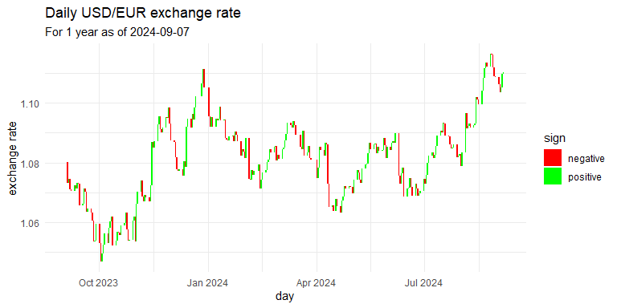

<!-- README.md is generated from README.Rmd. Please edit that file -->

# EXR // EXchangeRates 

<!-- badges: start -->

[](https://www.repostatus.org/#wip)
[](https://github.com/obsaditelnost/EXR/actions/workflows/R-CMD-check.yaml)
[](https://app.codecov.io/gh/obsaditelnost/EXR)
[](https://cran.r-project.org/web/licenses/MIT)

<!-- badges: end -->

## Overview

Get currency exchange rates (‘EXR’) or directly apply currency
conversion on a tibble from one to another currency based on spot prices
(average) provided by ‘ECB Data Portal’ (European Central Bank). If
neither the price currency nor base currency is EUR, unofficial
cross-rates based on EUR will be calculated. The main purpose of this
package is to offer an unlimited and free way to get (potentially
approximate) important exchange rates.

|                                   |                                                      |
|-----------------------------------|------------------------------------------------------|
| **Why use this package?**         | **When not to use this package**                     |
| ✅Free API with decades of data   | ❌If you need intraday data                          |
| ✅Unlimited API calls             | ❌If you need ask / bid / mid prices                 |
| ✅No key or registration required | ❌If you need rates from a specific domain (non-ECB) |
| ✅Helpful errors and warnings     | ❌If you need exchange rates for business purposes   |
| ✅Works well with tables          | ❌If you need exchange rates for all currencies      |

## What this package can do

- Get exchange rate for a currency pair
- Get exchange rate history for a currency pair or multiple pairs
- Get all cross-rates for a specific day (or a subset)
- Get last N days of exchange rate history
- You have a `data.table` (or tibble) with a currency value and you want
  to transform it to another currency
  - maybe the base currency is dynamic and a separate column in your
    table?
  - maybe the table contains different dates, specified in a column

## Limitations and considerations

- Only supports currencies that have a ECB Euro foreign exchange
  reference rate.
- Because only reference rates are available, the calculation of
  cross-rates might be very different from official exchange rates,
  especially for currencies with less trade volume
- API results are not deterministic. Data may be added or changed at any
  time
- API answer might take some seconds for huge requests or massive load
  on the web service

## Installation

You can install the development version of EXR from
[GitHub](https://github.com/) with:

``` r
# install.packages("pak")
pak::pak("obsaditelnost/EXR")
```

## Requirements

You need to have access to the [ECB Data Web Service
API](https://data-api.ecb.europa.eu/ "ECB Data Web Service API")

## Code examples

### Available currencies

Let’s first see which currencies are actually available:

``` r
EXR::get_available_currencies()
#> # A tibble: 31 × 2
#>   ISOCODE TITLE            
#>   <chr>   <chr>            
#> 1 AUD     Australian dollar
#> 2 BGN     Bulgarian lev    
#> 3 BRL     Brazilian real   
#> 4 CAD     Canadian dollar  
#> 5 CHF     Swiss franc      
#> # ℹ 26 more rows
```

This can be displayed a bit prettier:

``` r
EXR::get_available_currencies() |>
  dplyr::mutate(flag = substr(ISOCODE, 1, 2)) |>
  dplyr::arrange(TITLE) |>
  gt::gt() |>
  gt::fmt_flag(columns = flag) |>
  gt::cols_merge(columns = c(flag, ISOCODE)) |>
  gt::cols_label(flag = "ISOCODE", TITLE = "Currency") |>
  gt::tab_header(
    title = "Available currencies",
    subtitle = gt::md(paste0("as of **", Sys.Date(), "**"))
  ) |>
  gt::tab_source_note("Source: https://data.ecb.europa.eu/") |>
  gt::tab_options(data_row.padding = gt::px(0)) |>
  gt::as_raw_html() # workaround for github_document
```

<div id="gjsqagszsh" style="padding-left:0px;padding-right:0px;padding-top:10px;padding-bottom:10px;overflow-x:auto;overflow-y:auto;width:auto;height:auto;">
  &#10;  <table class="gt_table" data-quarto-disable-processing="false" data-quarto-bootstrap="false" style="-webkit-font-smoothing: antialiased; -moz-osx-font-smoothing: grayscale; font-family: system-ui, 'Segoe UI', Roboto, Helvetica, Arial, sans-serif, 'Apple Color Emoji', 'Segoe UI Emoji', 'Segoe UI Symbol', 'Noto Color Emoji'; display: table; border-collapse: collapse; line-height: normal; margin-left: auto; margin-right: auto; color: #333333; font-size: 16px; font-weight: normal; font-style: normal; background-color: #FFFFFF; width: auto; border-top-style: solid; border-top-width: 2px; border-top-color: #A8A8A8; border-right-style: none; border-right-width: 2px; border-right-color: #D3D3D3; border-bottom-style: solid; border-bottom-width: 2px; border-bottom-color: #A8A8A8; border-left-style: none; border-left-width: 2px; border-left-color: #D3D3D3;" bgcolor="#FFFFFF">
  <thead style="border-style: none;">
    <tr class="gt_heading" style="border-style: none; background-color: #FFFFFF; text-align: center; border-bottom-color: #FFFFFF; border-left-style: none; border-left-width: 1px; border-left-color: #D3D3D3; border-right-style: none; border-right-width: 1px; border-right-color: #D3D3D3;" bgcolor="#FFFFFF" align="center">
      <td colspan="2" class="gt_heading gt_title gt_font_normal" style="border-style: none; color: #333333; font-size: 125%; padding-top: 4px; padding-bottom: 4px; padding-left: 5px; padding-right: 5px; border-bottom-width: 0; background-color: #FFFFFF; text-align: center; border-bottom-color: #FFFFFF; border-left-style: none; border-left-width: 1px; border-left-color: #D3D3D3; border-right-style: none; border-right-width: 1px; border-right-color: #D3D3D3; font-weight: normal;" bgcolor="#FFFFFF" align="center">Available currencies</td>
    </tr>
    <tr class="gt_heading" style="border-style: none; background-color: #FFFFFF; text-align: center; border-bottom-color: #FFFFFF; border-left-style: none; border-left-width: 1px; border-left-color: #D3D3D3; border-right-style: none; border-right-width: 1px; border-right-color: #D3D3D3;" bgcolor="#FFFFFF" align="center">
      <td colspan="2" class="gt_heading gt_subtitle gt_font_normal gt_bottom_border" style="border-style: none; color: #333333; font-size: 85%; padding-top: 3px; padding-bottom: 5px; padding-left: 5px; padding-right: 5px; border-top-color: #FFFFFF; border-top-width: 0; background-color: #FFFFFF; text-align: center; border-left-style: none; border-left-width: 1px; border-left-color: #D3D3D3; border-right-style: none; border-right-width: 1px; border-right-color: #D3D3D3; border-bottom-style: solid; border-bottom-width: 2px; border-bottom-color: #D3D3D3; font-weight: normal;" bgcolor="#FFFFFF" align="center"><span class="gt_from_md">as of <strong style="margin-top: 0; margin-bottom: 0;">2024-09-03</strong></span></td>
    </tr>
    <tr class="gt_col_headings" style="border-style: none; border-top-style: solid; border-top-width: 2px; border-top-color: #D3D3D3; border-bottom-style: solid; border-bottom-width: 2px; border-bottom-color: #D3D3D3; border-left-style: none; border-left-width: 1px; border-left-color: #D3D3D3; border-right-style: none; border-right-width: 1px; border-right-color: #D3D3D3;">
      <th class="gt_col_heading gt_columns_bottom_border gt_left" rowspan="1" colspan="1" scope="col" id="Currency" style="border-style: none; color: #333333; background-color: #FFFFFF; font-size: 100%; font-weight: normal; text-transform: inherit; border-left-style: none; border-left-width: 1px; border-left-color: #D3D3D3; border-right-style: none; border-right-width: 1px; border-right-color: #D3D3D3; vertical-align: bottom; padding-top: 5px; padding-bottom: 6px; padding-left: 5px; padding-right: 5px; overflow-x: hidden; text-align: left;" bgcolor="#FFFFFF" valign="bottom" align="left">Currency</th>
      <th class="gt_col_heading gt_columns_bottom_border gt_left" rowspan="1" colspan="1" scope="col" id="ISOCODE" style="border-style: none; color: #333333; background-color: #FFFFFF; font-size: 100%; font-weight: normal; text-transform: inherit; border-left-style: none; border-left-width: 1px; border-left-color: #D3D3D3; border-right-style: none; border-right-width: 1px; border-right-color: #D3D3D3; vertical-align: bottom; padding-top: 5px; padding-bottom: 6px; padding-left: 5px; padding-right: 5px; overflow-x: hidden; text-align: left;" bgcolor="#FFFFFF" valign="bottom" align="left">ISOCODE</th>
    </tr>
  </thead>
  <tbody class="gt_table_body" style="border-style: none; border-top-style: solid; border-top-width: 2px; border-top-color: #D3D3D3; border-bottom-style: solid; border-bottom-width: 2px; border-bottom-color: #D3D3D3;">
    <tr style="border-style: none;"><td headers="TITLE" class="gt_row gt_left" style="border-style: none; padding-top: 0px; padding-bottom: 0px; padding-left: 5px; padding-right: 5px; margin: 10px; border-top-style: solid; border-top-width: 1px; border-top-color: #D3D3D3; border-left-style: none; border-left-width: 1px; border-left-color: #D3D3D3; border-right-style: none; border-right-width: 1px; border-right-color: #D3D3D3; vertical-align: middle; overflow-x: hidden; text-align: left;" valign="middle" align="left">Australian dollar</td>
<td headers="flag" class="gt_row gt_left" style="border-style: none; padding-top: 0px; padding-bottom: 0px; padding-left: 5px; padding-right: 5px; margin: 10px; border-top-style: solid; border-top-width: 1px; border-top-color: #D3D3D3; border-left-style: none; border-left-width: 1px; border-left-color: #D3D3D3; border-right-style: none; border-right-width: 1px; border-right-color: #D3D3D3; vertical-align: middle; overflow-x: hidden; text-align: left;" valign="middle" align="left"><span style="white-space:nowrap;"><svg xmlns="http://www.w3.org/2000/svg" aria-hidden="true" role="img" width="512" height="512" viewBox="0 0 512 512" style="vertical-align:-0.125em;image-rendering:optimizeQuality;height:1em;width:1em;"><title>Australia</title><mask id="a"><circle cx="256" cy="256" r="256" fill="#fff"/></mask><g mask="url(#a)"><path fill="#0052b4" d="M0 0h512v512H0z"/><path fill="#eee" d="m154 300 14 30 32-8-14 30 25 20-32 7 1 33-26-21-26 21 1-33-33-7 26-20-14-30 32 8zm222-27h47l-38 27 15-44 14 44zm7-162 7 15 16-4-7 15 12 10-15 3v17l-13-11-13 11v-17l-15-3 12-10-7-15 16 4zm57 67 7 15 16-4-7 15 12 10-15 3v16l-13-10-13 11v-17l-15-3 12-10-7-15 16 4zm-122 22 7 15 16-4-7 15 12 10-15 3v16l-13-10-13 11v-17l-15-3 12-10-7-15 16 4zm65 156 7 15 16-4-7 15 12 10-15 3v17l-13-11-13 11v-17l-15-3 12-10-7-15 16 4zM0 0v32l32 32L0 96v160h32l32-32 32 32h32v-83l83 83h45l-8-16 8-15v-14l-83-83h83V96l-32-32 32-32V0H96L64 32 32 0Z"/><path fill="#d80027" d="M32 0v32H0v64h32v160h64V96h160V32H96V0Zm96 128 128 128v-31l-97-97z"/></g></svg></span> AUD</td></tr>
    <tr style="border-style: none;"><td headers="TITLE" class="gt_row gt_left" style="border-style: none; padding-top: 0px; padding-bottom: 0px; padding-left: 5px; padding-right: 5px; margin: 10px; border-top-style: solid; border-top-width: 1px; border-top-color: #D3D3D3; border-left-style: none; border-left-width: 1px; border-left-color: #D3D3D3; border-right-style: none; border-right-width: 1px; border-right-color: #D3D3D3; vertical-align: middle; overflow-x: hidden; text-align: left;" valign="middle" align="left">Brazilian real</td>
<td headers="flag" class="gt_row gt_left" style="border-style: none; padding-top: 0px; padding-bottom: 0px; padding-left: 5px; padding-right: 5px; margin: 10px; border-top-style: solid; border-top-width: 1px; border-top-color: #D3D3D3; border-left-style: none; border-left-width: 1px; border-left-color: #D3D3D3; border-right-style: none; border-right-width: 1px; border-right-color: #D3D3D3; vertical-align: middle; overflow-x: hidden; text-align: left;" valign="middle" align="left"><span style="white-space:nowrap;"><svg xmlns="http://www.w3.org/2000/svg" aria-hidden="true" role="img" width="512" height="512" viewBox="0 0 512 512" style="vertical-align:-0.125em;image-rendering:optimizeQuality;height:1em;width:1em;"><title>Brazil</title><mask id="a"><circle cx="256" cy="256" r="256" fill="#fff"/></mask><g mask="url(#a)"><path fill="#6da544" d="M0 0h512v512H0z"/><path fill="#ffda44" d="M256 100.2 467.5 256 256 411.8 44.5 256z"/><path fill="#eee" d="M174.2 221a87 87 0 0 0-7.2 36.3l162 49.8a88.5 88.5 0 0 0 14.4-34c-40.6-65.3-119.7-80.3-169.1-52z"/><path fill="#0052b4" d="M255.7 167a89 89 0 0 0-41.9 10.6 89 89 0 0 0-39.6 43.4 181.7 181.7 0 0 1 169.1 52.2 89 89 0 0 0-9-59.4 89 89 0 0 0-78.6-46.8zM212 250.5a149 149 0 0 0-45 6.8 89 89 0 0 0 10.5 40.9 89 89 0 0 0 120.6 36.2 89 89 0 0 0 30.7-27.3A151 151 0 0 0 212 250.5z"/></g></svg></span> BRL</td></tr>
    <tr style="border-style: none;"><td headers="TITLE" class="gt_row gt_left" style="border-style: none; padding-top: 0px; padding-bottom: 0px; padding-left: 5px; padding-right: 5px; margin: 10px; border-top-style: solid; border-top-width: 1px; border-top-color: #D3D3D3; border-left-style: none; border-left-width: 1px; border-left-color: #D3D3D3; border-right-style: none; border-right-width: 1px; border-right-color: #D3D3D3; vertical-align: middle; overflow-x: hidden; text-align: left;" valign="middle" align="left">Bulgarian lev</td>
<td headers="flag" class="gt_row gt_left" style="border-style: none; padding-top: 0px; padding-bottom: 0px; padding-left: 5px; padding-right: 5px; margin: 10px; border-top-style: solid; border-top-width: 1px; border-top-color: #D3D3D3; border-left-style: none; border-left-width: 1px; border-left-color: #D3D3D3; border-right-style: none; border-right-width: 1px; border-right-color: #D3D3D3; vertical-align: middle; overflow-x: hidden; text-align: left;" valign="middle" align="left"><span style="white-space:nowrap;"><svg xmlns="http://www.w3.org/2000/svg" aria-hidden="true" role="img" width="512" height="512" viewBox="0 0 512 512" style="vertical-align:-0.125em;image-rendering:optimizeQuality;height:1em;width:1em;"><title>Bulgaria</title><mask id="a"><circle cx="256" cy="256" r="256" fill="#fff"/></mask><g mask="url(#a)"><path fill="#496e2d" d="m0 166.9 258-31.7 254 31.7v178l-251.4 41.3L0 344.9z"/><path fill="#eee" d="M0 0h512v166.9H0z"/><path fill="#d80027" d="M0 344.9h512V512H0z"/></g></svg></span> BGN</td></tr>
    <tr style="border-style: none;"><td headers="TITLE" class="gt_row gt_left" style="border-style: none; padding-top: 0px; padding-bottom: 0px; padding-left: 5px; padding-right: 5px; margin: 10px; border-top-style: solid; border-top-width: 1px; border-top-color: #D3D3D3; border-left-style: none; border-left-width: 1px; border-left-color: #D3D3D3; border-right-style: none; border-right-width: 1px; border-right-color: #D3D3D3; vertical-align: middle; overflow-x: hidden; text-align: left;" valign="middle" align="left">Canadian dollar</td>
<td headers="flag" class="gt_row gt_left" style="border-style: none; padding-top: 0px; padding-bottom: 0px; padding-left: 5px; padding-right: 5px; margin: 10px; border-top-style: solid; border-top-width: 1px; border-top-color: #D3D3D3; border-left-style: none; border-left-width: 1px; border-left-color: #D3D3D3; border-right-style: none; border-right-width: 1px; border-right-color: #D3D3D3; vertical-align: middle; overflow-x: hidden; text-align: left;" valign="middle" align="left"><span style="white-space:nowrap;"><svg xmlns="http://www.w3.org/2000/svg" aria-hidden="true" role="img" width="512" height="512" viewBox="0 0 512 512" style="vertical-align:-0.125em;image-rendering:optimizeQuality;height:1em;width:1em;"><title>Canada</title><mask id="a"><circle cx="256" cy="256" r="256" fill="#fff"/></mask><g mask="url(#a)"><path fill="#d80027" d="M0 0v512h144l112-64 112 64h144V0H368L256 64 144 0Z"/><path fill="#eee" d="M144 0h224v512H144Z"/><path fill="#d80027" d="m301 289 44-22-22-11v-22l-45 22 23-44h-23l-22-34-22 33h-23l23 45-45-22v22l-22 11 45 22-12 23h45v33h22v-33h45z"/></g></svg></span> CAD</td></tr>
    <tr style="border-style: none;"><td headers="TITLE" class="gt_row gt_left" style="border-style: none; padding-top: 0px; padding-bottom: 0px; padding-left: 5px; padding-right: 5px; margin: 10px; border-top-style: solid; border-top-width: 1px; border-top-color: #D3D3D3; border-left-style: none; border-left-width: 1px; border-left-color: #D3D3D3; border-right-style: none; border-right-width: 1px; border-right-color: #D3D3D3; vertical-align: middle; overflow-x: hidden; text-align: left;" valign="middle" align="left">Chinese yuan renminbi</td>
<td headers="flag" class="gt_row gt_left" style="border-style: none; padding-top: 0px; padding-bottom: 0px; padding-left: 5px; padding-right: 5px; margin: 10px; border-top-style: solid; border-top-width: 1px; border-top-color: #D3D3D3; border-left-style: none; border-left-width: 1px; border-left-color: #D3D3D3; border-right-style: none; border-right-width: 1px; border-right-color: #D3D3D3; vertical-align: middle; overflow-x: hidden; text-align: left;" valign="middle" align="left"><span style="white-space:nowrap;"><svg xmlns="http://www.w3.org/2000/svg" aria-hidden="true" role="img" width="512" height="512" viewBox="0 0 512 512" style="vertical-align:-0.125em;image-rendering:optimizeQuality;height:1em;width:1em;"><title>China</title><mask id="a"><circle cx="256" cy="256" r="256" fill="#fff"/></mask><g mask="url(#a)"><path fill="#d80027" d="M0 0h512v512H0z"/><path fill="#ffda44" d="m140.1 155.8 22.1 68h71.5l-57.8 42.1 22.1 68-57.9-42-57.9 42 22.2-68-57.9-42.1H118zm163.4 240.7-16.9-20.8-25 9.7 14.5-22.5-16.9-20.9 25.9 6.9 14.6-22.5 1.4 26.8 26 6.9-25.1 9.6zm33.6-61 8-25.6-21.9-15.5 26.8-.4 7.9-25.6 8.7 25.4 26.8-.3-21.5 16 8.6 25.4-21.9-15.5zm45.3-147.6L370.6 212l19.2 18.7-26.5-3.8-11.8 24-4.6-26.4-26.6-3.8 23.8-12.5-4.6-26.5 19.2 18.7zm-78.2-73-2 26.7 24.9 10.1-26.1 6.4-1.9 26.8-14.1-22.8-26.1 6.4 17.3-20.5-14.2-22.7 24.9 10.1z"/></g></svg></span> CNY</td></tr>
    <tr style="border-style: none;"><td headers="TITLE" class="gt_row gt_left" style="border-style: none; padding-top: 0px; padding-bottom: 0px; padding-left: 5px; padding-right: 5px; margin: 10px; border-top-style: solid; border-top-width: 1px; border-top-color: #D3D3D3; border-left-style: none; border-left-width: 1px; border-left-color: #D3D3D3; border-right-style: none; border-right-width: 1px; border-right-color: #D3D3D3; vertical-align: middle; overflow-x: hidden; text-align: left;" valign="middle" align="left">Czech koruna</td>
<td headers="flag" class="gt_row gt_left" style="border-style: none; padding-top: 0px; padding-bottom: 0px; padding-left: 5px; padding-right: 5px; margin: 10px; border-top-style: solid; border-top-width: 1px; border-top-color: #D3D3D3; border-left-style: none; border-left-width: 1px; border-left-color: #D3D3D3; border-right-style: none; border-right-width: 1px; border-right-color: #D3D3D3; vertical-align: middle; overflow-x: hidden; text-align: left;" valign="middle" align="left"><span style="white-space:nowrap;"><svg xmlns="http://www.w3.org/2000/svg" aria-hidden="true" role="img" width="512" height="512" viewBox="0 0 512 512" style="vertical-align:-0.125em;image-rendering:optimizeQuality;height:1em;width:1em;"><title>Czech Republic</title><mask id="a"><circle cx="256" cy="256" r="256" fill="#fff"/></mask><g mask="url(#a)"><path fill="#eee" d="M0 0h512v256l-265 45.2z"/><path fill="#d80027" d="M210 256h302v256H0z"/><path fill="#0052b4" d="M0 0v512l256-256L0 0z"/></g></svg></span> CZK</td></tr>
    <tr style="border-style: none;"><td headers="TITLE" class="gt_row gt_left" style="border-style: none; padding-top: 0px; padding-bottom: 0px; padding-left: 5px; padding-right: 5px; margin: 10px; border-top-style: solid; border-top-width: 1px; border-top-color: #D3D3D3; border-left-style: none; border-left-width: 1px; border-left-color: #D3D3D3; border-right-style: none; border-right-width: 1px; border-right-color: #D3D3D3; vertical-align: middle; overflow-x: hidden; text-align: left;" valign="middle" align="left">Danish krone</td>
<td headers="flag" class="gt_row gt_left" style="border-style: none; padding-top: 0px; padding-bottom: 0px; padding-left: 5px; padding-right: 5px; margin: 10px; border-top-style: solid; border-top-width: 1px; border-top-color: #D3D3D3; border-left-style: none; border-left-width: 1px; border-left-color: #D3D3D3; border-right-style: none; border-right-width: 1px; border-right-color: #D3D3D3; vertical-align: middle; overflow-x: hidden; text-align: left;" valign="middle" align="left"><span style="white-space:nowrap;"><svg xmlns="http://www.w3.org/2000/svg" aria-hidden="true" role="img" width="512" height="512" viewBox="0 0 512 512" style="vertical-align:-0.125em;image-rendering:optimizeQuality;height:1em;width:1em;"><title>Denmark</title><mask id="a"><circle cx="256" cy="256" r="256" fill="#fff"/></mask><g mask="url(#a)"><path fill="#d80027" d="M0 0h133.6l32.7 20.3 34-20.3H512v222.6L491.4 256l20.6 33.4V512H200.3l-31.7-20.4-35 20.4H0V289.4l29.4-33L0 222.7z"/><path fill="#eee" d="M133.6 0v222.6H0v66.8h133.6V512h66.7V289.4H512v-66.8H200.3V0h-66.7z"/></g></svg></span> DKK</td></tr>
    <tr style="border-style: none;"><td headers="TITLE" class="gt_row gt_left" style="border-style: none; padding-top: 0px; padding-bottom: 0px; padding-left: 5px; padding-right: 5px; margin: 10px; border-top-style: solid; border-top-width: 1px; border-top-color: #D3D3D3; border-left-style: none; border-left-width: 1px; border-left-color: #D3D3D3; border-right-style: none; border-right-width: 1px; border-right-color: #D3D3D3; vertical-align: middle; overflow-x: hidden; text-align: left;" valign="middle" align="left">Euro</td>
<td headers="flag" class="gt_row gt_left" style="border-style: none; padding-top: 0px; padding-bottom: 0px; padding-left: 5px; padding-right: 5px; margin: 10px; border-top-style: solid; border-top-width: 1px; border-top-color: #D3D3D3; border-left-style: none; border-left-width: 1px; border-left-color: #D3D3D3; border-right-style: none; border-right-width: 1px; border-right-color: #D3D3D3; vertical-align: middle; overflow-x: hidden; text-align: left;" valign="middle" align="left"><span style="white-space:nowrap;"><svg xmlns="http://www.w3.org/2000/svg" aria-hidden="true" role="img" width="512" height="512" viewBox="0 0 512 512" style="vertical-align:-0.125em;image-rendering:optimizeQuality;height:1em;width:1em;"><title>European Union</title><mask id="a"><circle cx="256" cy="256" r="256" fill="#fff"/></mask><g mask="url(#a)"><path fill="#0052b4" d="M0 0h512v512H0z"/><path fill="#ffda44" d="m256 100.2 8.3 25.5H291l-21.7 15.7 8.3 25.6-21.7-15.8-21.7 15.8 8.3-25.6-21.7-15.7h26.8zm-110.2 45.6 24 12.2 18.9-19-4.2 26.5 23.9 12.2-26.5 4.2-4.2 26.5-12.2-24-26.5 4.3 19-19zM100.2 256l25.5-8.3V221l15.7 21.7 25.6-8.3-15.8 21.7 15.8 21.7-25.6-8.3-15.7 21.7v-26.8zm45.6 110.2 12.2-24-19-18.9 26.5 4.2 12.2-23.9 4.2 26.5 26.5 4.2-24 12.2 4.3 26.5-19-19zM256 411.8l-8.3-25.5H221l21.7-15.7-8.3-25.6 21.7 15.8 21.7-15.8-8.3 25.6 21.7 15.7h-26.8zm110.2-45.6-24-12.2-18.9 19 4.2-26.5-23.9-12.2 26.5-4.2 4.2-26.5 12.2 24 26.5-4.3-19 19zM411.8 256l-25.5 8.3V291l-15.7-21.7-25.6 8.3 15.8-21.7-15.8-21.7 25.6 8.3 15.7-21.7v26.8zm-45.6-110.2-12.2 24 19 18.9-26.5-4.2-12.2 23.9-4.2-26.5-26.5-4.2 24-12.2-4.3-26.5 19 19z"/></g></svg></span> EUR</td></tr>
    <tr style="border-style: none;"><td headers="TITLE" class="gt_row gt_left" style="border-style: none; padding-top: 0px; padding-bottom: 0px; padding-left: 5px; padding-right: 5px; margin: 10px; border-top-style: solid; border-top-width: 1px; border-top-color: #D3D3D3; border-left-style: none; border-left-width: 1px; border-left-color: #D3D3D3; border-right-style: none; border-right-width: 1px; border-right-color: #D3D3D3; vertical-align: middle; overflow-x: hidden; text-align: left;" valign="middle" align="left">Hong Kong dollar</td>
<td headers="flag" class="gt_row gt_left" style="border-style: none; padding-top: 0px; padding-bottom: 0px; padding-left: 5px; padding-right: 5px; margin: 10px; border-top-style: solid; border-top-width: 1px; border-top-color: #D3D3D3; border-left-style: none; border-left-width: 1px; border-left-color: #D3D3D3; border-right-style: none; border-right-width: 1px; border-right-color: #D3D3D3; vertical-align: middle; overflow-x: hidden; text-align: left;" valign="middle" align="left"><span style="white-space:nowrap;"><svg xmlns="http://www.w3.org/2000/svg" aria-hidden="true" role="img" width="512" height="512" viewBox="0 0 512 512" style="vertical-align:-0.125em;image-rendering:optimizeQuality;height:1em;width:1em;"><title>Hong Kong</title><mask id="a"><circle cx="256" cy="256" r="256" fill="#fff"/></mask><g mask="url(#a)"><path fill="#d80027" d="M0 0h512v512H0z"/><path fill="#eee" d="M282.4 193.7c-5.8 24.2-16.1 19.6-21.2 40.7a55.7 55.7 0 0 1 26-108.3c-10.1 42.2.4 46-4.8 67.6zM205 211.6c21.2 13 13.6 21.4 32.1 32.8a55.7 55.7 0 0 1-94.9-58.2c37 22.7 43.8 13.8 62.8 25.4zm-7 79.3c19-16.2 24.7-6.4 41.2-20.4a55.7 55.7 0 0 1-84.7 72.2c33-28.2 26.6-37.4 43.6-51.8zm73.4 31c-9.6-23 1.5-25.3-6.8-45.3a55.7 55.7 0 0 1 42.6 102.8c-16.6-40-27.3-36.9-35.8-57.4zm52.2-60c-24.9 2-23.7-9.3-45.3-7.6a55.7 55.7 0 0 1 111-8.7c-43.3 3.4-43.6 14.5-65.7 16.3z"/></g></svg></span> HKD</td></tr>
    <tr style="border-style: none;"><td headers="TITLE" class="gt_row gt_left" style="border-style: none; padding-top: 0px; padding-bottom: 0px; padding-left: 5px; padding-right: 5px; margin: 10px; border-top-style: solid; border-top-width: 1px; border-top-color: #D3D3D3; border-left-style: none; border-left-width: 1px; border-left-color: #D3D3D3; border-right-style: none; border-right-width: 1px; border-right-color: #D3D3D3; vertical-align: middle; overflow-x: hidden; text-align: left;" valign="middle" align="left">Hungarian forint</td>
<td headers="flag" class="gt_row gt_left" style="border-style: none; padding-top: 0px; padding-bottom: 0px; padding-left: 5px; padding-right: 5px; margin: 10px; border-top-style: solid; border-top-width: 1px; border-top-color: #D3D3D3; border-left-style: none; border-left-width: 1px; border-left-color: #D3D3D3; border-right-style: none; border-right-width: 1px; border-right-color: #D3D3D3; vertical-align: middle; overflow-x: hidden; text-align: left;" valign="middle" align="left"><span style="white-space:nowrap;"><svg xmlns="http://www.w3.org/2000/svg" aria-hidden="true" role="img" width="512" height="512" viewBox="0 0 512 512" style="vertical-align:-0.125em;image-rendering:optimizeQuality;height:1em;width:1em;"><title>Hungary</title><mask id="a"><circle cx="256" cy="256" r="256" fill="#fff"/></mask><g mask="url(#a)"><path fill="#eee" d="m0 167 253.8-19.3L512 167v178l-254.9 32.3L0 345z"/><path fill="#d80027" d="M0 0h512v167H0z"/><path fill="#6da544" d="M0 345h512v167H0z"/></g></svg></span> HUF</td></tr>
    <tr style="border-style: none;"><td headers="TITLE" class="gt_row gt_left" style="border-style: none; padding-top: 0px; padding-bottom: 0px; padding-left: 5px; padding-right: 5px; margin: 10px; border-top-style: solid; border-top-width: 1px; border-top-color: #D3D3D3; border-left-style: none; border-left-width: 1px; border-left-color: #D3D3D3; border-right-style: none; border-right-width: 1px; border-right-color: #D3D3D3; vertical-align: middle; overflow-x: hidden; text-align: left;" valign="middle" align="left">Iceland krona</td>
<td headers="flag" class="gt_row gt_left" style="border-style: none; padding-top: 0px; padding-bottom: 0px; padding-left: 5px; padding-right: 5px; margin: 10px; border-top-style: solid; border-top-width: 1px; border-top-color: #D3D3D3; border-left-style: none; border-left-width: 1px; border-left-color: #D3D3D3; border-right-style: none; border-right-width: 1px; border-right-color: #D3D3D3; vertical-align: middle; overflow-x: hidden; text-align: left;" valign="middle" align="left"><span style="white-space:nowrap;"><svg xmlns="http://www.w3.org/2000/svg" aria-hidden="true" role="img" width="512" height="512" viewBox="0 0 512 512" style="vertical-align:-0.125em;image-rendering:optimizeQuality;height:1em;width:1em;"><title>Iceland</title><mask id="a"><circle cx="256" cy="256" r="256" fill="#fff"/></mask><g mask="url(#a)"><path fill="#0052b4" d="M0 0h100.2l66.1 53.5L233.7 0H512v189.3L466.3 257l45.7 65.8V512H233.7l-68-50.7-65.5 50.7H0V322.8l51.4-68.5-51.4-65z"/><path fill="#eee" d="M100.2 0v189.3H0v33.4l24.6 33L0 289.5v33.4h100.2V512h33.4l30.6-26.3 36.1 26.3h33.4V322.8H512v-33.4l-24.6-33.7 24.6-33v-33.4H233.7V0h-33.4l-33.8 25.3L133.6 0z"/><path fill="#d80027" d="M133.6 0v222.7H0v66.7h133.6V512h66.7V289.4H512v-66.7H200.3V0z"/></g></svg></span> ISK</td></tr>
    <tr style="border-style: none;"><td headers="TITLE" class="gt_row gt_left" style="border-style: none; padding-top: 0px; padding-bottom: 0px; padding-left: 5px; padding-right: 5px; margin: 10px; border-top-style: solid; border-top-width: 1px; border-top-color: #D3D3D3; border-left-style: none; border-left-width: 1px; border-left-color: #D3D3D3; border-right-style: none; border-right-width: 1px; border-right-color: #D3D3D3; vertical-align: middle; overflow-x: hidden; text-align: left;" valign="middle" align="left">Indian rupee</td>
<td headers="flag" class="gt_row gt_left" style="border-style: none; padding-top: 0px; padding-bottom: 0px; padding-left: 5px; padding-right: 5px; margin: 10px; border-top-style: solid; border-top-width: 1px; border-top-color: #D3D3D3; border-left-style: none; border-left-width: 1px; border-left-color: #D3D3D3; border-right-style: none; border-right-width: 1px; border-right-color: #D3D3D3; vertical-align: middle; overflow-x: hidden; text-align: left;" valign="middle" align="left"><span style="white-space:nowrap;"><svg xmlns="http://www.w3.org/2000/svg" aria-hidden="true" role="img" width="512" height="512" viewBox="0 0 512 512" style="vertical-align:-0.125em;image-rendering:optimizeQuality;height:1em;width:1em;"><title>India</title><mask id="a"><circle cx="256" cy="256" r="256" fill="#fff"/></mask><g mask="url(#a)"><path fill="#eee" d="m0 160 256-32 256 32v192l-256 32L0 352z"/><path fill="#ff9811" d="M0 0h512v160H0Z"/><path fill="#6da544" d="M0 352h512v160H0Z"/><circle cx="256" cy="256" r="72" fill="#0052b4"/><circle cx="256" cy="256" r="48" fill="#eee"/><circle cx="256" cy="256" r="24" fill="#0052b4"/></g></svg></span> INR</td></tr>
    <tr style="border-style: none;"><td headers="TITLE" class="gt_row gt_left" style="border-style: none; padding-top: 0px; padding-bottom: 0px; padding-left: 5px; padding-right: 5px; margin: 10px; border-top-style: solid; border-top-width: 1px; border-top-color: #D3D3D3; border-left-style: none; border-left-width: 1px; border-left-color: #D3D3D3; border-right-style: none; border-right-width: 1px; border-right-color: #D3D3D3; vertical-align: middle; overflow-x: hidden; text-align: left;" valign="middle" align="left">Indonesian rupiah</td>
<td headers="flag" class="gt_row gt_left" style="border-style: none; padding-top: 0px; padding-bottom: 0px; padding-left: 5px; padding-right: 5px; margin: 10px; border-top-style: solid; border-top-width: 1px; border-top-color: #D3D3D3; border-left-style: none; border-left-width: 1px; border-left-color: #D3D3D3; border-right-style: none; border-right-width: 1px; border-right-color: #D3D3D3; vertical-align: middle; overflow-x: hidden; text-align: left;" valign="middle" align="left"><span style="white-space:nowrap;"><svg xmlns="http://www.w3.org/2000/svg" aria-hidden="true" role="img" width="512" height="512" viewBox="0 0 512 512" style="vertical-align:-0.125em;image-rendering:optimizeQuality;height:1em;width:1em;"><title>Indonesia</title><mask id="a"><circle cx="256" cy="256" r="256" fill="#fff"/></mask><g mask="url(#a)"><path fill="#eee" d="m0 256 249.6-41.3L512 256v256H0z"/><path fill="#a2001d" d="M0 0h512v256H0z"/></g></svg></span> IDR</td></tr>
    <tr style="border-style: none;"><td headers="TITLE" class="gt_row gt_left" style="border-style: none; padding-top: 0px; padding-bottom: 0px; padding-left: 5px; padding-right: 5px; margin: 10px; border-top-style: solid; border-top-width: 1px; border-top-color: #D3D3D3; border-left-style: none; border-left-width: 1px; border-left-color: #D3D3D3; border-right-style: none; border-right-width: 1px; border-right-color: #D3D3D3; vertical-align: middle; overflow-x: hidden; text-align: left;" valign="middle" align="left">Israeli shekel</td>
<td headers="flag" class="gt_row gt_left" style="border-style: none; padding-top: 0px; padding-bottom: 0px; padding-left: 5px; padding-right: 5px; margin: 10px; border-top-style: solid; border-top-width: 1px; border-top-color: #D3D3D3; border-left-style: none; border-left-width: 1px; border-left-color: #D3D3D3; border-right-style: none; border-right-width: 1px; border-right-color: #D3D3D3; vertical-align: middle; overflow-x: hidden; text-align: left;" valign="middle" align="left"><span style="white-space:nowrap;"><svg xmlns="http://www.w3.org/2000/svg" aria-hidden="true" role="img" width="512" height="512" viewBox="0 0 512 512" style="vertical-align:-0.125em;image-rendering:optimizeQuality;height:1em;width:1em;"><title>Israel</title><mask id="a"><circle cx="256" cy="256" r="256" fill="#fff"/></mask><g mask="url(#a)"><path fill="#eee" d="M0 0h512v55.7l-25 32.7 25 34v267.2l-26 36 26 30.7V512H0v-55.7l24.8-34.1L0 389.6V122.4l27.2-33.2L0 55.7z"/><path fill="#0052b4" d="M0 55.7v66.7h512V55.7zm0 333.9v66.7h512v-66.7zm352.4-189.3H288l-32-55.6-32.1 55.6h-64.3l32.1 55.7-32 55.7h64.2l32.1 55.6 32.1-55.6h64.3L320.3 256l32-55.7zm-57 55.7-19.7 34.2h-39.4L216.5 256l19.8-34.2h39.4l19.8 34.2zM256 187.6l7.3 12.7h-14.6zm-59.2 34.2h14.7l-7.4 12.7zm0 68.4 7.3-12.7 7.4 12.7zm59.2 34.2-7.3-12.7h14.6zm59.2-34.2h-14.7l7.4-12.7zm-14.7-68.4h14.7l-7.3 12.7z"/></g></svg></span> ILS</td></tr>
    <tr style="border-style: none;"><td headers="TITLE" class="gt_row gt_left" style="border-style: none; padding-top: 0px; padding-bottom: 0px; padding-left: 5px; padding-right: 5px; margin: 10px; border-top-style: solid; border-top-width: 1px; border-top-color: #D3D3D3; border-left-style: none; border-left-width: 1px; border-left-color: #D3D3D3; border-right-style: none; border-right-width: 1px; border-right-color: #D3D3D3; vertical-align: middle; overflow-x: hidden; text-align: left;" valign="middle" align="left">Japanese yen</td>
<td headers="flag" class="gt_row gt_left" style="border-style: none; padding-top: 0px; padding-bottom: 0px; padding-left: 5px; padding-right: 5px; margin: 10px; border-top-style: solid; border-top-width: 1px; border-top-color: #D3D3D3; border-left-style: none; border-left-width: 1px; border-left-color: #D3D3D3; border-right-style: none; border-right-width: 1px; border-right-color: #D3D3D3; vertical-align: middle; overflow-x: hidden; text-align: left;" valign="middle" align="left"><span style="white-space:nowrap;"><svg xmlns="http://www.w3.org/2000/svg" aria-hidden="true" role="img" width="512" height="512" viewBox="0 0 512 512" style="vertical-align:-0.125em;image-rendering:optimizeQuality;height:1em;width:1em;"><title>Japan</title><mask id="a"><circle cx="256" cy="256" r="256" fill="#fff"/></mask><g mask="url(#a)"><path fill="#eee" d="M0 0h512v512H0z"/><circle cx="256" cy="256" r="111.3" fill="#d80027"/></g></svg></span> JPY</td></tr>
    <tr style="border-style: none;"><td headers="TITLE" class="gt_row gt_left" style="border-style: none; padding-top: 0px; padding-bottom: 0px; padding-left: 5px; padding-right: 5px; margin: 10px; border-top-style: solid; border-top-width: 1px; border-top-color: #D3D3D3; border-left-style: none; border-left-width: 1px; border-left-color: #D3D3D3; border-right-style: none; border-right-width: 1px; border-right-color: #D3D3D3; vertical-align: middle; overflow-x: hidden; text-align: left;" valign="middle" align="left">Korean won (Republic)</td>
<td headers="flag" class="gt_row gt_left" style="border-style: none; padding-top: 0px; padding-bottom: 0px; padding-left: 5px; padding-right: 5px; margin: 10px; border-top-style: solid; border-top-width: 1px; border-top-color: #D3D3D3; border-left-style: none; border-left-width: 1px; border-left-color: #D3D3D3; border-right-style: none; border-right-width: 1px; border-right-color: #D3D3D3; vertical-align: middle; overflow-x: hidden; text-align: left;" valign="middle" align="left"><span style="white-space:nowrap;"><svg xmlns="http://www.w3.org/2000/svg" aria-hidden="true" role="img" width="512" height="512" viewBox="0 0 512 512" style="vertical-align:-0.125em;image-rendering:optimizeQuality;height:1em;width:1em;"><title>South Korea</title><mask id="a"><circle cx="256" cy="256" r="256" fill="#fff"/></mask><g mask="url(#a)"><path fill="#eee" d="M0 0h512v512H0Z"/><path fill="#333" d="m350 335 24-24 16 16-24 23zm-39 39 24-24 15 16-23 24zm87 8 23-24 16 16-24 24zm-40 39 24-23 16 15-24 24Zm16-63 24-23 15 15-23 24zm-39 40 23-24 16 16-24 23zm63-221-63-63 15-15 64 63zm-63-15-24-24 16-16 23 24zm39 39-24-24 16-15 24 23zm8-87-24-23 16-16 24 24Zm39 40-23-24 15-16 24 24ZM91 358l63 63-16 16-63-63zm63 16 23 24-15 15-24-23zm-40-39 24 23-16 16-23-24zm24-24 63 63-16 16-63-63zm16-220-63 63-16-16 63-63zm23 23-63 63-15-16 63-63zm24 24-63 63-16-16 63-63z"/><path fill="#d80027" d="M319 319 193 193a89 89 0 1 1 126 126z"/><path fill="#0052b4" d="M319 319a89 89 0 1 1-126-126z"/><circle cx="224.5" cy="224.5" r="44.5" fill="#d80027"/><circle cx="287.5" cy="287.5" r="44.5" fill="#0052b4"/></g></svg></span> KRW</td></tr>
    <tr style="border-style: none;"><td headers="TITLE" class="gt_row gt_left" style="border-style: none; padding-top: 0px; padding-bottom: 0px; padding-left: 5px; padding-right: 5px; margin: 10px; border-top-style: solid; border-top-width: 1px; border-top-color: #D3D3D3; border-left-style: none; border-left-width: 1px; border-left-color: #D3D3D3; border-right-style: none; border-right-width: 1px; border-right-color: #D3D3D3; vertical-align: middle; overflow-x: hidden; text-align: left;" valign="middle" align="left">Malaysian ringgit</td>
<td headers="flag" class="gt_row gt_left" style="border-style: none; padding-top: 0px; padding-bottom: 0px; padding-left: 5px; padding-right: 5px; margin: 10px; border-top-style: solid; border-top-width: 1px; border-top-color: #D3D3D3; border-left-style: none; border-left-width: 1px; border-left-color: #D3D3D3; border-right-style: none; border-right-width: 1px; border-right-color: #D3D3D3; vertical-align: middle; overflow-x: hidden; text-align: left;" valign="middle" align="left"><span style="white-space:nowrap;"><svg xmlns="http://www.w3.org/2000/svg" aria-hidden="true" role="img" width="512" height="512" viewBox="0 0 512 512" style="vertical-align:-0.125em;image-rendering:optimizeQuality;height:1em;width:1em;"><title>Malaysia</title><mask id="a"><circle cx="256" cy="256" r="256" fill="#fff"/></mask><g mask="url(#a)"><path fill="#eee" d="M0 256 256 0h256v55.7l-19.5 33 19.5 33.7v66.8l-22.1 37.7L512 256v66.8l-20.2 38.5 20.2 28.3v66.7l-254.5 28.2L0 456.3v-66.7l26-35.1-26-31.7z"/><path fill="#d80027" d="M256 256h256v-66.8H222.9zm-33.1-133.6H512V55.7H222.9zM512 512v-55.7H0V512zM0 389.6h512v-66.8H0z"/><path fill="#0052b4" d="M0 0h256v256H0z"/><g fill="#ffda44"><path d="M170.2 219.1a63.3 63.3 0 1 1 30.1-119 78 78 0 1 0 0 111.4 63 63 0 0 1-30 7.6z"/><path d="m188 111.3 11.3 23.5 25.4-5.9-11.4 23.5 20.4 16.2-25.4 5.7.1 26-20.3-16.2-20.4 16.2.1-26-25.4-5.7 20.4-16.2-11.4-23.5 25.4 6z"/></g></g></svg></span> MYR</td></tr>
    <tr style="border-style: none;"><td headers="TITLE" class="gt_row gt_left" style="border-style: none; padding-top: 0px; padding-bottom: 0px; padding-left: 5px; padding-right: 5px; margin: 10px; border-top-style: solid; border-top-width: 1px; border-top-color: #D3D3D3; border-left-style: none; border-left-width: 1px; border-left-color: #D3D3D3; border-right-style: none; border-right-width: 1px; border-right-color: #D3D3D3; vertical-align: middle; overflow-x: hidden; text-align: left;" valign="middle" align="left">Mexican peso</td>
<td headers="flag" class="gt_row gt_left" style="border-style: none; padding-top: 0px; padding-bottom: 0px; padding-left: 5px; padding-right: 5px; margin: 10px; border-top-style: solid; border-top-width: 1px; border-top-color: #D3D3D3; border-left-style: none; border-left-width: 1px; border-left-color: #D3D3D3; border-right-style: none; border-right-width: 1px; border-right-color: #D3D3D3; vertical-align: middle; overflow-x: hidden; text-align: left;" valign="middle" align="left"><span style="white-space:nowrap;"><svg xmlns="http://www.w3.org/2000/svg" aria-hidden="true" role="img" width="512" height="512" viewBox="0 0 512 512" style="vertical-align:-0.125em;image-rendering:optimizeQuality;height:1em;width:1em;"><title>Mexico</title><mask id="a"><circle cx="256" cy="256" r="256" fill="#fff"/></mask><g mask="url(#a)"><path fill="#eee" d="M144 0h223l33 256-33 256H144l-32-256z"/><path fill="#496e2d" d="M0 0h144v512H0z"/><path fill="#d80027" d="M368 0h144v512H368z"/><path fill="#ffda44" d="M256 277v10h12l10-22z"/><path fill="#496e2d" d="M160 242a96 96 0 0 0 192 0h-11a85 85 0 0 1-170 0zm39 17-4 2c-2 2-2 6 1 8 15 14 34 22 54 24v17h12v-17c20-2 39-10 54-24 3-2 3-6 1-8s-6-2-8 0a78 78 0 0 1-53 21c-19 0-38-8-53-21z"/><path fill="#338af3" d="M256 316c-14 0-28-5-40-13l6-9c20 13 48 13 68 0l7 9c-12 8-26 13-41 13z"/><path fill="#751a46" d="M256 174c22 11 12 33 11 34l-2-4c-5-11-18-18-31-18v11c6 0 11 5 11 11-7 7-9 17-4 26l4 8-13 23 29-7 18 18v-11l11 11 23-11-35-21-5-21 28 16c4 11 12 21 23 26 9-83-42-91-61-91z"/><path fill="#6da544" d="M222 271c-15 0-33-12-38-40l11-2c4 23 18 31 27 31 3 0 5-1 6-3 0-2 0-3-6-5-3-1-7-2-10-5-10-12 4-24 11-30 1-1 2-2 1-3 0 0-2-2-5-2-7 0-12-4-14-11-2-6 2-13 8-17l5 11c-2 0-2 2-2 4 0 0 1 2 3 2 7 0 14 4 16 9 1 3 2 9-5 15-7 7-11 12-9 15l5 1c5 2 14 5 13 17-1 8-8 13-17 13h-1z"/><path fill="#ffda44" d="m234 186-12 11v11l18-9c3-1 3-5 1-7z"/><circle cx="172" cy="275" r="8" fill="#ffda44"/><circle cx="189" cy="302" r="8" fill="#ffda44"/><circle cx="216" cy="323" r="8" fill="#ffda44"/><circle cx="297" cy="323" r="8" fill="#ffda44"/><circle cx="324" cy="302" r="8" fill="#ffda44"/><circle cx="341" cy="275" r="8" fill="#ffda44"/><rect width="34" height="22" x="239" y="299" fill="#ff9811" rx="11" ry="11"/></g></svg></span> MXN</td></tr>
    <tr style="border-style: none;"><td headers="TITLE" class="gt_row gt_left" style="border-style: none; padding-top: 0px; padding-bottom: 0px; padding-left: 5px; padding-right: 5px; margin: 10px; border-top-style: solid; border-top-width: 1px; border-top-color: #D3D3D3; border-left-style: none; border-left-width: 1px; border-left-color: #D3D3D3; border-right-style: none; border-right-width: 1px; border-right-color: #D3D3D3; vertical-align: middle; overflow-x: hidden; text-align: left;" valign="middle" align="left">New Zealand dollar</td>
<td headers="flag" class="gt_row gt_left" style="border-style: none; padding-top: 0px; padding-bottom: 0px; padding-left: 5px; padding-right: 5px; margin: 10px; border-top-style: solid; border-top-width: 1px; border-top-color: #D3D3D3; border-left-style: none; border-left-width: 1px; border-left-color: #D3D3D3; border-right-style: none; border-right-width: 1px; border-right-color: #D3D3D3; vertical-align: middle; overflow-x: hidden; text-align: left;" valign="middle" align="left"><span style="white-space:nowrap;"><svg xmlns="http://www.w3.org/2000/svg" aria-hidden="true" role="img" width="512" height="512" viewBox="0 0 512 512" style="vertical-align:-0.125em;image-rendering:optimizeQuality;height:1em;width:1em;"><title>New Zealand</title><mask id="a"><circle cx="256" cy="256" r="256" fill="#fff"/></mask><g mask="url(#a)"><path fill="#0052b4" d="M256 0h256v512H0V256Z"/><path fill="#eee" d="M0 0v32l32 32L0 96v160h32l32-32 32 32h32v-83l83 83h45l-8-16 8-15v-14l-83-83h83V96l-32-32 32-32V0H96L64 32 32 0Zm382 92-11 35h-37l30 21-12 35 30-22 30 22-12-35 30-21h-37l-11-35Zm61 72-11 35h-37l30 21-11 35 29-21 30 21-12-35 30-21h-37Zm-123 10-11 35h-37l30 22-11 35 29-22 30 22-11-35 29-22h-36zm59 130-11 35h-37l30 21-11 35 29-21 30 21-11-35 29-21h-36z"/><path fill="#d80027" d="M32 0v32H0v64h32v160h64V96h160V32H96V0Zm96 128 128 128v-31l-97-97zm251 201-5 18h-19l15 10-6 18 15-11 15 11-5-18 14-10h-18Zm-59-129-5 17h-19l15 11-6 17 15-11 15 11-6-17 15-11h-18l-6-17zm123-11-6 18h-18l15 11-6 17 15-11 15 11-6-17 15-11h-18l-6-18zm-61-72-6 17h-18l15 11-6 17 15-10 15 10-6-17 15-11h-18z"/></g></svg></span> NZD</td></tr>
    <tr style="border-style: none;"><td headers="TITLE" class="gt_row gt_left" style="border-style: none; padding-top: 0px; padding-bottom: 0px; padding-left: 5px; padding-right: 5px; margin: 10px; border-top-style: solid; border-top-width: 1px; border-top-color: #D3D3D3; border-left-style: none; border-left-width: 1px; border-left-color: #D3D3D3; border-right-style: none; border-right-width: 1px; border-right-color: #D3D3D3; vertical-align: middle; overflow-x: hidden; text-align: left;" valign="middle" align="left">Norwegian krone</td>
<td headers="flag" class="gt_row gt_left" style="border-style: none; padding-top: 0px; padding-bottom: 0px; padding-left: 5px; padding-right: 5px; margin: 10px; border-top-style: solid; border-top-width: 1px; border-top-color: #D3D3D3; border-left-style: none; border-left-width: 1px; border-left-color: #D3D3D3; border-right-style: none; border-right-width: 1px; border-right-color: #D3D3D3; vertical-align: middle; overflow-x: hidden; text-align: left;" valign="middle" align="left"><span style="white-space:nowrap;"><svg xmlns="http://www.w3.org/2000/svg" aria-hidden="true" role="img" width="512" height="512" viewBox="0 0 512 512" style="vertical-align:-0.125em;image-rendering:optimizeQuality;height:1em;width:1em;"><title>Norway</title><mask id="a"><circle cx="256" cy="256" r="256" fill="#fff"/></mask><g mask="url(#a)"><path fill="#d80027" d="M0 0h100.2l66.1 53.5L233.7 0H512v189.3L466.3 257l45.7 65.8V512H233.7l-68-50.7-65.5 50.7H0V322.8l51.4-68.5-51.4-65z"/><path fill="#eee" d="M100.2 0v189.3H0v33.4l24.6 33L0 289.5v33.4h100.2V512h33.4l30.6-26.3 36.1 26.3h33.4V322.8H512v-33.4l-24.6-33.7 24.6-33v-33.4H233.7V0h-33.4l-33.8 25.3L133.6 0z"/><path fill="#0052b4" d="M133.6 0v222.7H0v66.7h133.6V512h66.7V289.4H512v-66.7H200.3V0z"/></g></svg></span> NOK</td></tr>
    <tr style="border-style: none;"><td headers="TITLE" class="gt_row gt_left" style="border-style: none; padding-top: 0px; padding-bottom: 0px; padding-left: 5px; padding-right: 5px; margin: 10px; border-top-style: solid; border-top-width: 1px; border-top-color: #D3D3D3; border-left-style: none; border-left-width: 1px; border-left-color: #D3D3D3; border-right-style: none; border-right-width: 1px; border-right-color: #D3D3D3; vertical-align: middle; overflow-x: hidden; text-align: left;" valign="middle" align="left">Philippine peso</td>
<td headers="flag" class="gt_row gt_left" style="border-style: none; padding-top: 0px; padding-bottom: 0px; padding-left: 5px; padding-right: 5px; margin: 10px; border-top-style: solid; border-top-width: 1px; border-top-color: #D3D3D3; border-left-style: none; border-left-width: 1px; border-left-color: #D3D3D3; border-right-style: none; border-right-width: 1px; border-right-color: #D3D3D3; vertical-align: middle; overflow-x: hidden; text-align: left;" valign="middle" align="left"><span style="white-space:nowrap;"><svg xmlns="http://www.w3.org/2000/svg" aria-hidden="true" role="img" width="512" height="512" viewBox="0 0 512 512" style="vertical-align:-0.125em;image-rendering:optimizeQuality;height:1em;width:1em;"><title>Philippines</title><mask id="a"><circle cx="256" cy="256" r="256" fill="#fff"/></mask><g mask="url(#a)"><path fill="#0052b4" d="M0 0h512v256l-265 45.2z"/><path fill="#d80027" d="M210 256h302v256H0z"/><path fill="#eee" d="M0 0v512l256-256z"/><path fill="#ffda44" d="M175.3 256 144 241.3l16.7-30.3-34 6.5-4.3-34.3-23.6 25.2L75 183.2l-4.3 34.3-34-6.5 16.7 30.3L22.3 256l31.2 14.7L37 301l34-6.5 4.2 34.3 23.7-25.2 23.6 25.2 4.3-34.3 34 6.5-16.7-30.3zm-107-155.8 10.4 14.5 17-5.4-10.6 14.4 10.4 14.5-17-5.6L68 147l.2-17.9-17-5.6 17-5.4zm0 264.8 10.4 14.6 17-5.4-10.6 14.3 10.4 14.6-17-5.7L68 411.8l.2-17.9-17-5.6 17-5.4zm148.4-132.4L206.3 247l-17-5.4 10.5 14.4-10.4 14.6 17-5.7 10.6 14.4-.1-17.9 17-5.6-17.1-5.4z"/></g></svg></span> PHP</td></tr>
    <tr style="border-style: none;"><td headers="TITLE" class="gt_row gt_left" style="border-style: none; padding-top: 0px; padding-bottom: 0px; padding-left: 5px; padding-right: 5px; margin: 10px; border-top-style: solid; border-top-width: 1px; border-top-color: #D3D3D3; border-left-style: none; border-left-width: 1px; border-left-color: #D3D3D3; border-right-style: none; border-right-width: 1px; border-right-color: #D3D3D3; vertical-align: middle; overflow-x: hidden; text-align: left;" valign="middle" align="left">Polish zloty</td>
<td headers="flag" class="gt_row gt_left" style="border-style: none; padding-top: 0px; padding-bottom: 0px; padding-left: 5px; padding-right: 5px; margin: 10px; border-top-style: solid; border-top-width: 1px; border-top-color: #D3D3D3; border-left-style: none; border-left-width: 1px; border-left-color: #D3D3D3; border-right-style: none; border-right-width: 1px; border-right-color: #D3D3D3; vertical-align: middle; overflow-x: hidden; text-align: left;" valign="middle" align="left"><span style="white-space:nowrap;"><svg xmlns="http://www.w3.org/2000/svg" aria-hidden="true" role="img" width="512" height="512" viewBox="0 0 512 512" style="vertical-align:-0.125em;image-rendering:optimizeQuality;height:1em;width:1em;"><title>Poland</title><mask id="a"><circle cx="256" cy="256" r="256" fill="#fff"/></mask><g mask="url(#a)"><path fill="#d80027" d="m0 256 256.4-44.3L512 256v256H0z"/><path fill="#eee" d="M0 0h512v256H0z"/></g></svg></span> PLN</td></tr>
    <tr style="border-style: none;"><td headers="TITLE" class="gt_row gt_left" style="border-style: none; padding-top: 0px; padding-bottom: 0px; padding-left: 5px; padding-right: 5px; margin: 10px; border-top-style: solid; border-top-width: 1px; border-top-color: #D3D3D3; border-left-style: none; border-left-width: 1px; border-left-color: #D3D3D3; border-right-style: none; border-right-width: 1px; border-right-color: #D3D3D3; vertical-align: middle; overflow-x: hidden; text-align: left;" valign="middle" align="left">Romanian leu</td>
<td headers="flag" class="gt_row gt_left" style="border-style: none; padding-top: 0px; padding-bottom: 0px; padding-left: 5px; padding-right: 5px; margin: 10px; border-top-style: solid; border-top-width: 1px; border-top-color: #D3D3D3; border-left-style: none; border-left-width: 1px; border-left-color: #D3D3D3; border-right-style: none; border-right-width: 1px; border-right-color: #D3D3D3; vertical-align: middle; overflow-x: hidden; text-align: left;" valign="middle" align="left"><span style="white-space:nowrap;"><svg xmlns="http://www.w3.org/2000/svg" aria-hidden="true" role="img" width="512" height="512" viewBox="0 0 512 512" style="vertical-align:-0.125em;image-rendering:optimizeQuality;height:1em;width:1em;"><title>Romania</title><mask id="a"><circle cx="256" cy="256" r="256" fill="#fff"/></mask><g mask="url(#a)"><path fill="#ffda44" d="M167 0h178l25.9 252.3L345 512H167l-29.8-253.4z"/><path fill="#0052b4" d="M0 0h167v512H0z"/><path fill="#d80027" d="M345 0h167v512H345z"/></g></svg></span> RON</td></tr>
    <tr style="border-style: none;"><td headers="TITLE" class="gt_row gt_left" style="border-style: none; padding-top: 0px; padding-bottom: 0px; padding-left: 5px; padding-right: 5px; margin: 10px; border-top-style: solid; border-top-width: 1px; border-top-color: #D3D3D3; border-left-style: none; border-left-width: 1px; border-left-color: #D3D3D3; border-right-style: none; border-right-width: 1px; border-right-color: #D3D3D3; vertical-align: middle; overflow-x: hidden; text-align: left;" valign="middle" align="left">Singapore dollar</td>
<td headers="flag" class="gt_row gt_left" style="border-style: none; padding-top: 0px; padding-bottom: 0px; padding-left: 5px; padding-right: 5px; margin: 10px; border-top-style: solid; border-top-width: 1px; border-top-color: #D3D3D3; border-left-style: none; border-left-width: 1px; border-left-color: #D3D3D3; border-right-style: none; border-right-width: 1px; border-right-color: #D3D3D3; vertical-align: middle; overflow-x: hidden; text-align: left;" valign="middle" align="left"><span style="white-space:nowrap;"><svg xmlns="http://www.w3.org/2000/svg" aria-hidden="true" role="img" width="512" height="512" viewBox="0 0 512 512" style="vertical-align:-0.125em;image-rendering:optimizeQuality;height:1em;width:1em;"><title>Singapore</title><mask id="a"><circle cx="256" cy="256" r="256" fill="#fff"/></mask><g mask="url(#a)"><path fill="#eee" d="m0 256 257.7-51L512 256v256H0z"/><path fill="#d80027" d="M0 0h512v256H0z"/><g fill="#eee"><path d="M155.8 133.6A78 78 0 0 1 217 57.5a78.2 78.2 0 0 0-16.7-1.8 78 78 0 1 0 16.7 154 78 78 0 0 1-61.2-76.1zM256 61.2l5.5 17h18l-14.6 10.5 5.6 17L256 95.2l-14.5 10.5 5.6-17-14.5-10.5h17.9z"/><path d="m212.6 94.6 5.6 17H236l-14.4 10.5 5.5 17-14.5-10.5-14.4 10.5 5.5-17-14.5-10.5h17.9zm86.8 0 5.5 17h17.9l-14.5 10.5 5.5 17-14.4-10.5-14.5 10.5 5.5-17-14.4-10.5h17.8zm-16.7 50.1 5.5 17h17.9l-14.5 10.5 5.5 17-14.4-10.5-14.5 10.5 5.5-17-14.4-10.5h17.9zm-53.4 0 5.5 17h18l-14.5 10.5 5.5 17-14.5-10.5-14.4 10.5 5.5-17-14.5-10.5h17.9z"/></g></g></svg></span> SGD</td></tr>
    <tr style="border-style: none;"><td headers="TITLE" class="gt_row gt_left" style="border-style: none; padding-top: 0px; padding-bottom: 0px; padding-left: 5px; padding-right: 5px; margin: 10px; border-top-style: solid; border-top-width: 1px; border-top-color: #D3D3D3; border-left-style: none; border-left-width: 1px; border-left-color: #D3D3D3; border-right-style: none; border-right-width: 1px; border-right-color: #D3D3D3; vertical-align: middle; overflow-x: hidden; text-align: left;" valign="middle" align="left">South African rand</td>
<td headers="flag" class="gt_row gt_left" style="border-style: none; padding-top: 0px; padding-bottom: 0px; padding-left: 5px; padding-right: 5px; margin: 10px; border-top-style: solid; border-top-width: 1px; border-top-color: #D3D3D3; border-left-style: none; border-left-width: 1px; border-left-color: #D3D3D3; border-right-style: none; border-right-width: 1px; border-right-color: #D3D3D3; vertical-align: middle; overflow-x: hidden; text-align: left;" valign="middle" align="left"><span style="white-space:nowrap;"><svg xmlns="http://www.w3.org/2000/svg" aria-hidden="true" role="img" width="512" height="512" viewBox="0 0 512 512" style="vertical-align:-0.125em;image-rendering:optimizeQuality;height:1em;width:1em;"><title>South Africa</title><mask id="a"><circle cx="256" cy="256" r="256" fill="#fff"/></mask><g mask="url(#a)"><path fill="#eee" d="m0 0 192 256L0 512h47l465-189v-34l-32-33 32-33v-34L47 0Z"/><path fill="#333" d="M0 142v228l140-114z"/><path fill="#ffda44" d="M192 256 0 95v47l114 114L0 370v47z"/><path fill="#6da544" d="M512 223H223L0 0v94l161 162L0 418v94l223-223h289z"/><path fill="#d80027" d="M512 0H47l189 189h276z"/><path fill="#0052b4" d="M512 512H47l189-189h276z"/></g></svg></span> ZAR</td></tr>
    <tr style="border-style: none;"><td headers="TITLE" class="gt_row gt_left" style="border-style: none; padding-top: 0px; padding-bottom: 0px; padding-left: 5px; padding-right: 5px; margin: 10px; border-top-style: solid; border-top-width: 1px; border-top-color: #D3D3D3; border-left-style: none; border-left-width: 1px; border-left-color: #D3D3D3; border-right-style: none; border-right-width: 1px; border-right-color: #D3D3D3; vertical-align: middle; overflow-x: hidden; text-align: left;" valign="middle" align="left">Swedish krona</td>
<td headers="flag" class="gt_row gt_left" style="border-style: none; padding-top: 0px; padding-bottom: 0px; padding-left: 5px; padding-right: 5px; margin: 10px; border-top-style: solid; border-top-width: 1px; border-top-color: #D3D3D3; border-left-style: none; border-left-width: 1px; border-left-color: #D3D3D3; border-right-style: none; border-right-width: 1px; border-right-color: #D3D3D3; vertical-align: middle; overflow-x: hidden; text-align: left;" valign="middle" align="left"><span style="white-space:nowrap;"><svg xmlns="http://www.w3.org/2000/svg" aria-hidden="true" role="img" width="512" height="512" viewBox="0 0 512 512" style="vertical-align:-0.125em;image-rendering:optimizeQuality;height:1em;width:1em;"><title>Sweden</title><mask id="a"><circle cx="256" cy="256" r="256" fill="#fff"/></mask><g mask="url(#a)"><path fill="#0052b4" d="M0 0h133.6l35.3 16.7L200.3 0H512v222.6l-22.6 31.7 22.6 35.1V512H200.3l-32-19.8-34.7 19.8H0V289.4l22.1-33.3L0 222.6z"/><path fill="#ffda44" d="M133.6 0v222.6H0v66.8h133.6V512h66.7V289.4H512v-66.8H200.3V0z"/></g></svg></span> SEK</td></tr>
    <tr style="border-style: none;"><td headers="TITLE" class="gt_row gt_left" style="border-style: none; padding-top: 0px; padding-bottom: 0px; padding-left: 5px; padding-right: 5px; margin: 10px; border-top-style: solid; border-top-width: 1px; border-top-color: #D3D3D3; border-left-style: none; border-left-width: 1px; border-left-color: #D3D3D3; border-right-style: none; border-right-width: 1px; border-right-color: #D3D3D3; vertical-align: middle; overflow-x: hidden; text-align: left;" valign="middle" align="left">Swiss franc</td>
<td headers="flag" class="gt_row gt_left" style="border-style: none; padding-top: 0px; padding-bottom: 0px; padding-left: 5px; padding-right: 5px; margin: 10px; border-top-style: solid; border-top-width: 1px; border-top-color: #D3D3D3; border-left-style: none; border-left-width: 1px; border-left-color: #D3D3D3; border-right-style: none; border-right-width: 1px; border-right-color: #D3D3D3; vertical-align: middle; overflow-x: hidden; text-align: left;" valign="middle" align="left"><span style="white-space:nowrap;"><svg xmlns="http://www.w3.org/2000/svg" aria-hidden="true" role="img" width="512" height="512" viewBox="0 0 512 512" style="vertical-align:-0.125em;image-rendering:optimizeQuality;height:1em;width:1em;"><title>Switzerland</title><mask id="a"><circle cx="256" cy="256" r="256" fill="#fff"/></mask><g mask="url(#a)"><path fill="#d80027" d="M0 0h512v512H0z"/><path fill="#eee" d="M389.6 211.5h-89v-89h-89.1v89h-89v89h89v89h89v-89h89z"/></g></svg></span> CHF</td></tr>
    <tr style="border-style: none;"><td headers="TITLE" class="gt_row gt_left" style="border-style: none; padding-top: 0px; padding-bottom: 0px; padding-left: 5px; padding-right: 5px; margin: 10px; border-top-style: solid; border-top-width: 1px; border-top-color: #D3D3D3; border-left-style: none; border-left-width: 1px; border-left-color: #D3D3D3; border-right-style: none; border-right-width: 1px; border-right-color: #D3D3D3; vertical-align: middle; overflow-x: hidden; text-align: left;" valign="middle" align="left">Thai baht</td>
<td headers="flag" class="gt_row gt_left" style="border-style: none; padding-top: 0px; padding-bottom: 0px; padding-left: 5px; padding-right: 5px; margin: 10px; border-top-style: solid; border-top-width: 1px; border-top-color: #D3D3D3; border-left-style: none; border-left-width: 1px; border-left-color: #D3D3D3; border-right-style: none; border-right-width: 1px; border-right-color: #D3D3D3; vertical-align: middle; overflow-x: hidden; text-align: left;" valign="middle" align="left"><span style="white-space:nowrap;"><svg xmlns="http://www.w3.org/2000/svg" aria-hidden="true" role="img" width="512" height="512" viewBox="0 0 512 512" style="vertical-align:-0.125em;image-rendering:optimizeQuality;height:1em;width:1em;"><title>Thailand</title><mask id="a"><circle cx="256" cy="256" r="256" fill="#fff"/></mask><g mask="url(#a)"><path fill="#d80027" d="M0 0h512v89l-79.2 163.7L512 423v89H0v-89l82.7-169.6L0 89z"/><path fill="#eee" d="M0 89h512v78l-42.6 91.2L512 345v78H0v-78l40-92.5L0 167z"/><path fill="#0052b4" d="M0 167h512v178H0z"/></g></svg></span> THB</td></tr>
    <tr style="border-style: none;"><td headers="TITLE" class="gt_row gt_left" style="border-style: none; padding-top: 0px; padding-bottom: 0px; padding-left: 5px; padding-right: 5px; margin: 10px; border-top-style: solid; border-top-width: 1px; border-top-color: #D3D3D3; border-left-style: none; border-left-width: 1px; border-left-color: #D3D3D3; border-right-style: none; border-right-width: 1px; border-right-color: #D3D3D3; vertical-align: middle; overflow-x: hidden; text-align: left;" valign="middle" align="left">Turkish lira</td>
<td headers="flag" class="gt_row gt_left" style="border-style: none; padding-top: 0px; padding-bottom: 0px; padding-left: 5px; padding-right: 5px; margin: 10px; border-top-style: solid; border-top-width: 1px; border-top-color: #D3D3D3; border-left-style: none; border-left-width: 1px; border-left-color: #D3D3D3; border-right-style: none; border-right-width: 1px; border-right-color: #D3D3D3; vertical-align: middle; overflow-x: hidden; text-align: left;" valign="middle" align="left"><span style="white-space:nowrap;"><svg xmlns="http://www.w3.org/2000/svg" aria-hidden="true" role="img" width="512" height="512" viewBox="0 0 512 512" style="vertical-align:-0.125em;image-rendering:optimizeQuality;height:1em;width:1em;"><title>Turkey</title><mask id="a"><circle cx="256" cy="256" r="256" fill="#fff"/></mask><g mask="url(#a)"><path fill="#d80027" d="M0 0h512v512H0z"/><g fill="#eee"><path d="m245.5 209.2 21 29 34-11.1-21 29 21 28.9-34-11.1-21 29V267l-34-11.1 34-11z"/><path d="M188.2 328.3a72.3 72.3 0 1 1 34.4-136 89 89 0 1 0 0 127.3 72 72 0 0 1-34.4 8.7z"/></g></g></svg></span> TRY</td></tr>
    <tr style="border-style: none;"><td headers="TITLE" class="gt_row gt_left" style="border-style: none; padding-top: 0px; padding-bottom: 0px; padding-left: 5px; padding-right: 5px; margin: 10px; border-top-style: solid; border-top-width: 1px; border-top-color: #D3D3D3; border-left-style: none; border-left-width: 1px; border-left-color: #D3D3D3; border-right-style: none; border-right-width: 1px; border-right-color: #D3D3D3; vertical-align: middle; overflow-x: hidden; text-align: left;" valign="middle" align="left">UK pound sterling</td>
<td headers="flag" class="gt_row gt_left" style="border-style: none; padding-top: 0px; padding-bottom: 0px; padding-left: 5px; padding-right: 5px; margin: 10px; border-top-style: solid; border-top-width: 1px; border-top-color: #D3D3D3; border-left-style: none; border-left-width: 1px; border-left-color: #D3D3D3; border-right-style: none; border-right-width: 1px; border-right-color: #D3D3D3; vertical-align: middle; overflow-x: hidden; text-align: left;" valign="middle" align="left"><span style="white-space:nowrap;"><svg xmlns="http://www.w3.org/2000/svg" aria-hidden="true" role="img" width="512" height="512" viewBox="0 0 512 512" style="vertical-align:-0.125em;image-rendering:optimizeQuality;height:1em;width:1em;"><title>United Kingdom</title><mask id="a"><circle cx="256" cy="256" r="256" fill="#fff"/></mask><g mask="url(#a)"><path fill="#eee" d="m0 0 8 22-8 23v23l32 54-32 54v32l32 48-32 48v32l32 54-32 54v68l22-8 23 8h23l54-32 54 32h32l48-32 48 32h32l54-32 54 32h68l-8-22 8-23v-23l-32-54 32-54v-32l-32-48 32-48v-32l-32-54 32-54V0l-22 8-23-8h-23l-54 32-54-32h-32l-48 32-48-32h-32l-54 32L68 0H0z"/><path fill="#0052b4" d="M336 0v108L444 0Zm176 68L404 176h108zM0 176h108L0 68ZM68 0l108 108V0Zm108 512V404L68 512ZM0 444l108-108H0Zm512-108H404l108 108Zm-68 176L336 404v108z"/><path fill="#d80027" d="M0 0v45l131 131h45L0 0zm208 0v208H0v96h208v208h96V304h208v-96H304V0h-96zm259 0L336 131v45L512 0h-45zM176 336 0 512h45l131-131v-45zm160 0 176 176v-45L381 336h-45z"/></g></svg></span> GBP</td></tr>
    <tr style="border-style: none;"><td headers="TITLE" class="gt_row gt_left" style="border-style: none; padding-top: 0px; padding-bottom: 0px; padding-left: 5px; padding-right: 5px; margin: 10px; border-top-style: solid; border-top-width: 1px; border-top-color: #D3D3D3; border-left-style: none; border-left-width: 1px; border-left-color: #D3D3D3; border-right-style: none; border-right-width: 1px; border-right-color: #D3D3D3; vertical-align: middle; overflow-x: hidden; text-align: left;" valign="middle" align="left">US dollar</td>
<td headers="flag" class="gt_row gt_left" style="border-style: none; padding-top: 0px; padding-bottom: 0px; padding-left: 5px; padding-right: 5px; margin: 10px; border-top-style: solid; border-top-width: 1px; border-top-color: #D3D3D3; border-left-style: none; border-left-width: 1px; border-left-color: #D3D3D3; border-right-style: none; border-right-width: 1px; border-right-color: #D3D3D3; vertical-align: middle; overflow-x: hidden; text-align: left;" valign="middle" align="left"><span style="white-space:nowrap;"><svg xmlns="http://www.w3.org/2000/svg" aria-hidden="true" role="img" width="512" height="512" viewBox="0 0 512 512" style="vertical-align:-0.125em;image-rendering:optimizeQuality;height:1em;width:1em;"><title>United States</title><mask id="a"><circle cx="256" cy="256" r="256" fill="#fff"/></mask><g mask="url(#a)"><path fill="#eee" d="M256 0h256v64l-32 32 32 32v64l-32 32 32 32v64l-32 32 32 32v64l-256 32L0 448v-64l32-32-32-32v-64z"/><path fill="#d80027" d="M224 64h288v64H224Zm0 128h288v64H256ZM0 320h512v64H0Zm0 128h512v64H0Z"/><path fill="#0052b4" d="M0 0h256v256H0Z"/><path fill="#eee" d="m187 243 57-41h-70l57 41-22-67zm-81 0 57-41H93l57 41-22-67zm-81 0 57-41H12l57 41-22-67zm162-81 57-41h-70l57 41-22-67zm-81 0 57-41H93l57 41-22-67zm-81 0 57-41H12l57 41-22-67Zm162-82 57-41h-70l57 41-22-67Zm-81 0 57-41H93l57 41-22-67zm-81 0 57-41H12l57 41-22-67Z"/></g></svg></span> USD</td></tr>
  </tbody>
  <tfoot class="gt_sourcenotes" style="border-style: none; color: #333333; background-color: #FFFFFF; border-bottom-style: none; border-bottom-width: 2px; border-bottom-color: #D3D3D3; border-left-style: none; border-left-width: 2px; border-left-color: #D3D3D3; border-right-style: none; border-right-width: 2px; border-right-color: #D3D3D3;" bgcolor="#FFFFFF">
    <tr style="border-style: none;">
      <td class="gt_sourcenote" colspan="2" style="border-style: none; font-size: 90%; padding-top: 4px; padding-bottom: 4px; padding-left: 5px; padding-right: 5px;">Source: https://data.ecb.europa.eu/</td>
    </tr>
  </tfoot>
  &#10;</table>
</div>

### Discontinued currencies

Some exchange rates have been published in the past, but are not
available any more:

``` r
dplyr::anti_join(
  EXR::get_available_currencies(as.Date("2014-01-02")),
  EXR::get_available_currencies(as.Date("2024-01-02")),
  by = dplyr::join_by(ISOCODE, TITLE)
) |>
  dplyr::mutate(flag = substr(ISOCODE, 1, 2), TITLE = gt::md(paste0("~", TITLE, "~"))) |>
  dplyr::arrange(TITLE) |>
  gt::gt() |>
  gt::fmt_flag(columns = flag) |>
  gt::fmt_markdown(columns = TITLE) |>
  gt::cols_merge(columns = c(flag, ISOCODE)) |>
  gt::cols_label(flag = "ISOCODE", TITLE = "Currency") |>
  gt::tab_header(
    title = "Discontinued currencies (temporarily or forever)",
    subtitle = gt::md(paste0("as of **", Sys.Date(), "**"))
  ) |>
  gt::tab_source_note("Source: https://data.ecb.europa.eu/")|>
  gt::tab_options(data_row.padding = gt::px(0)) |>
  gt::cols_align(align = "left", columns = TITLE)|>
  gt::as_raw_html() # workaround for github_document
```

<div id="hzaccycalt" style="padding-left:0px;padding-right:0px;padding-top:10px;padding-bottom:10px;overflow-x:auto;overflow-y:auto;width:auto;height:auto;">
  &#10;  <table class="gt_table" data-quarto-disable-processing="false" data-quarto-bootstrap="false" style="-webkit-font-smoothing: antialiased; -moz-osx-font-smoothing: grayscale; font-family: system-ui, 'Segoe UI', Roboto, Helvetica, Arial, sans-serif, 'Apple Color Emoji', 'Segoe UI Emoji', 'Segoe UI Symbol', 'Noto Color Emoji'; display: table; border-collapse: collapse; line-height: normal; margin-left: auto; margin-right: auto; color: #333333; font-size: 16px; font-weight: normal; font-style: normal; background-color: #FFFFFF; width: auto; border-top-style: solid; border-top-width: 2px; border-top-color: #A8A8A8; border-right-style: none; border-right-width: 2px; border-right-color: #D3D3D3; border-bottom-style: solid; border-bottom-width: 2px; border-bottom-color: #A8A8A8; border-left-style: none; border-left-width: 2px; border-left-color: #D3D3D3;" bgcolor="#FFFFFF">
  <thead style="border-style: none;">
    <tr class="gt_heading" style="border-style: none; background-color: #FFFFFF; text-align: center; border-bottom-color: #FFFFFF; border-left-style: none; border-left-width: 1px; border-left-color: #D3D3D3; border-right-style: none; border-right-width: 1px; border-right-color: #D3D3D3;" bgcolor="#FFFFFF" align="center">
      <td colspan="2" class="gt_heading gt_title gt_font_normal" style="border-style: none; color: #333333; font-size: 125%; padding-top: 4px; padding-bottom: 4px; padding-left: 5px; padding-right: 5px; border-bottom-width: 0; background-color: #FFFFFF; text-align: center; border-bottom-color: #FFFFFF; border-left-style: none; border-left-width: 1px; border-left-color: #D3D3D3; border-right-style: none; border-right-width: 1px; border-right-color: #D3D3D3; font-weight: normal;" bgcolor="#FFFFFF" align="center">Discontinued currencies (temporarily or forever)</td>
    </tr>
    <tr class="gt_heading" style="border-style: none; background-color: #FFFFFF; text-align: center; border-bottom-color: #FFFFFF; border-left-style: none; border-left-width: 1px; border-left-color: #D3D3D3; border-right-style: none; border-right-width: 1px; border-right-color: #D3D3D3;" bgcolor="#FFFFFF" align="center">
      <td colspan="2" class="gt_heading gt_subtitle gt_font_normal gt_bottom_border" style="border-style: none; color: #333333; font-size: 85%; padding-top: 3px; padding-bottom: 5px; padding-left: 5px; padding-right: 5px; border-top-color: #FFFFFF; border-top-width: 0; background-color: #FFFFFF; text-align: center; border-left-style: none; border-left-width: 1px; border-left-color: #D3D3D3; border-right-style: none; border-right-width: 1px; border-right-color: #D3D3D3; border-bottom-style: solid; border-bottom-width: 2px; border-bottom-color: #D3D3D3; font-weight: normal;" bgcolor="#FFFFFF" align="center"><span class="gt_from_md">as of <strong style="margin-top: 0; margin-bottom: 0;">2024-09-03</strong></span></td>
    </tr>
    <tr class="gt_col_headings" style="border-style: none; border-top-style: solid; border-top-width: 2px; border-top-color: #D3D3D3; border-bottom-style: solid; border-bottom-width: 2px; border-bottom-color: #D3D3D3; border-left-style: none; border-left-width: 1px; border-left-color: #D3D3D3; border-right-style: none; border-right-width: 1px; border-right-color: #D3D3D3;">
      <th class="gt_col_heading gt_columns_bottom_border gt_left" rowspan="1" colspan="1" scope="col" id="Currency" style="border-style: none; color: #333333; background-color: #FFFFFF; font-size: 100%; font-weight: normal; text-transform: inherit; border-left-style: none; border-left-width: 1px; border-left-color: #D3D3D3; border-right-style: none; border-right-width: 1px; border-right-color: #D3D3D3; vertical-align: bottom; padding-top: 5px; padding-bottom: 6px; padding-left: 5px; padding-right: 5px; overflow-x: hidden; text-align: left;" bgcolor="#FFFFFF" valign="bottom" align="left">Currency</th>
      <th class="gt_col_heading gt_columns_bottom_border gt_left" rowspan="1" colspan="1" scope="col" id="ISOCODE" style="border-style: none; color: #333333; background-color: #FFFFFF; font-size: 100%; font-weight: normal; text-transform: inherit; border-left-style: none; border-left-width: 1px; border-left-color: #D3D3D3; border-right-style: none; border-right-width: 1px; border-right-color: #D3D3D3; vertical-align: bottom; padding-top: 5px; padding-bottom: 6px; padding-left: 5px; padding-right: 5px; overflow-x: hidden; text-align: left;" bgcolor="#FFFFFF" valign="bottom" align="left">ISOCODE</th>
    </tr>
  </thead>
  <tbody class="gt_table_body" style="border-style: none; border-top-style: solid; border-top-width: 2px; border-top-color: #D3D3D3; border-bottom-style: solid; border-bottom-width: 2px; border-bottom-color: #D3D3D3;">
    <tr style="border-style: none;"><td headers="TITLE" class="gt_row gt_left" style="border-style: none; padding-top: 0px; padding-bottom: 0px; padding-left: 5px; padding-right: 5px; margin: 10px; border-top-style: solid; border-top-width: 1px; border-top-color: #D3D3D3; border-left-style: none; border-left-width: 1px; border-left-color: #D3D3D3; border-right-style: none; border-right-width: 1px; border-right-color: #D3D3D3; vertical-align: middle; overflow-x: hidden; text-align: left;" valign="middle" align="left"><span class="gt_from_md"><del style="margin-top: 0; margin-bottom: 0;">Algerian dinar</del></span></td>
<td headers="flag" class="gt_row gt_left" style="border-style: none; padding-top: 0px; padding-bottom: 0px; padding-left: 5px; padding-right: 5px; margin: 10px; border-top-style: solid; border-top-width: 1px; border-top-color: #D3D3D3; border-left-style: none; border-left-width: 1px; border-left-color: #D3D3D3; border-right-style: none; border-right-width: 1px; border-right-color: #D3D3D3; vertical-align: middle; overflow-x: hidden; text-align: left;" valign="middle" align="left"><span style="white-space:nowrap;"><svg xmlns="http://www.w3.org/2000/svg" aria-hidden="true" role="img" width="512" height="512" viewBox="0 0 512 512" style="vertical-align:-0.125em;image-rendering:optimizeQuality;height:1em;width:1em;"><title>Algeria</title><mask id="a"><circle cx="256" cy="256" r="256" fill="#fff"/></mask><g mask="url(#a)"><path fill="#496e2d" d="M0 0h256l45.3 251.8L256 512H0z"/><path fill="#eee" d="M256 0h256v512H256z"/><g fill="#d80027"><path d="m311 206.9-21 29-34-11 21 28.8-21 29 34-11.1 21 29v-35.8l34-11.1-34-11z"/><path d="M277.2 328.3a72.3 72.3 0 1 1 34.5-136 89 89 0 1 0 0 127.3 72 72 0 0 1-34.5 8.7z"/></g></g></svg></span> DZD</td></tr>
    <tr style="border-style: none;"><td headers="TITLE" class="gt_row gt_left" style="border-style: none; padding-top: 0px; padding-bottom: 0px; padding-left: 5px; padding-right: 5px; margin: 10px; border-top-style: solid; border-top-width: 1px; border-top-color: #D3D3D3; border-left-style: none; border-left-width: 1px; border-left-color: #D3D3D3; border-right-style: none; border-right-width: 1px; border-right-color: #D3D3D3; vertical-align: middle; overflow-x: hidden; text-align: left;" valign="middle" align="left"><span class="gt_from_md"><del style="margin-top: 0; margin-bottom: 0;">Argentine peso</del></span></td>
<td headers="flag" class="gt_row gt_left" style="border-style: none; padding-top: 0px; padding-bottom: 0px; padding-left: 5px; padding-right: 5px; margin: 10px; border-top-style: solid; border-top-width: 1px; border-top-color: #D3D3D3; border-left-style: none; border-left-width: 1px; border-left-color: #D3D3D3; border-right-style: none; border-right-width: 1px; border-right-color: #D3D3D3; vertical-align: middle; overflow-x: hidden; text-align: left;" valign="middle" align="left"><span style="white-space:nowrap;"><svg xmlns="http://www.w3.org/2000/svg" aria-hidden="true" role="img" width="512" height="512" viewBox="0 0 512 512" style="vertical-align:-0.125em;image-rendering:optimizeQuality;height:1em;width:1em;"><title>Argentina</title><mask id="a"><circle cx="256" cy="256" r="256" fill="#fff"/></mask><g mask="url(#a)"><path fill="#338af3" d="M0 0h512v144.7L488 256l24 111.3V512H0V367.3L26 256 0 144.7z"/><path fill="#eee" d="M0 144.7h512v222.6H0z"/><path fill="#ffda44" d="m332.4 256-31.2 14.7 16.7 30.3-34-6.5-4.2 34.3-23.7-25.2-23.6 25.2-4.3-34.3-34 6.5 16.6-30.3-31.2-14.7 31.3-14.7L194 211l34 6.5 4.3-34.3 23.6 25.2 23.6-25.2 4.4 34.3 34-6.5-16.7 30.3z"/></g></svg></span> ARS</td></tr>
    <tr style="border-style: none;"><td headers="TITLE" class="gt_row gt_left" style="border-style: none; padding-top: 0px; padding-bottom: 0px; padding-left: 5px; padding-right: 5px; margin: 10px; border-top-style: solid; border-top-width: 1px; border-top-color: #D3D3D3; border-left-style: none; border-left-width: 1px; border-left-color: #D3D3D3; border-right-style: none; border-right-width: 1px; border-right-color: #D3D3D3; vertical-align: middle; overflow-x: hidden; text-align: left;" valign="middle" align="left"><span class="gt_from_md"><del style="margin-top: 0; margin-bottom: 0;">Croatian kuna</del></span></td>
<td headers="flag" class="gt_row gt_left" style="border-style: none; padding-top: 0px; padding-bottom: 0px; padding-left: 5px; padding-right: 5px; margin: 10px; border-top-style: solid; border-top-width: 1px; border-top-color: #D3D3D3; border-left-style: none; border-left-width: 1px; border-left-color: #D3D3D3; border-right-style: none; border-right-width: 1px; border-right-color: #D3D3D3; vertical-align: middle; overflow-x: hidden; text-align: left;" valign="middle" align="left"><span style="white-space:nowrap;"><svg xmlns="http://www.w3.org/2000/svg" aria-hidden="true" role="img" width="512" height="512" viewBox="0 0 512 512" style="vertical-align:-0.125em;image-rendering:optimizeQuality;height:1em;width:1em;"><title>Croatia</title><mask id="a"><circle cx="256" cy="256" r="256" fill="#fff"/></mask><g mask="url(#a)"><path fill="#eee" d="m0 167 253.8-19.3L512 167v178l-254.9 32.3L0 345z"/><path fill="#d80027" d="M0 0h512v167H0z"/><path fill="#0052b4" d="M0 345h512v167H0z"/><path fill="#338af3" d="M322.8 178h-44.5l7.4-55.7 29.7-22.2 29.6 22.2V167zm-133.6 0h44.5l-7.4-55.7-29.7-22.2-29.6 22.2V167z"/><path fill="#0052b4" d="M285.7 178h-59.4v-55.7l29.7-22.2 29.7 22.2z"/><path fill="#eee" d="M167 167v122.3a89 89 0 0 0 35.8 71.3l15.5-3.9 19.7 19.8a89.1 89.1 0 0 0 18 1.8 89 89 0 0 0 17.9-1.8l22.4-18.7 13 2.8a89 89 0 0 0 35.7-71.3V167z"/><path fill="#d80027" d="M167 167h35.6v35.5H167zm71.2 0h35.6v35.5h-35.6zm71.2 0H345v35.5h-35.6zm-106.8 35.5h35.6v35.6h-35.6zm71.2 0h35.6v35.6h-35.6zM167 238.1h35.6v35.6H167zm35.6 35.6h35.6v35.6h-35.6zm35.6-35.6h35.6v35.6h-35.6zm71.2 0H345v35.6h-35.6zm-35.6 35.6h35.6v35.6h-35.6zm-35.6 35.6h35.6V345h-35.6zm-35.6 0h-33.3c3 13.3 9 25.4 17.3 35.6h16zM309.4 345h16a88.8 88.8 0 0 0 17.3-35.6h-33.3zm-106.8 0v15.6a88.7 88.7 0 0 0 35.6 16V345zm71.2 0v31.6a88.7 88.7 0 0 0 35.6-16V345z"/></g></svg></span> HRK</td></tr>
    <tr style="border-style: none;"><td headers="TITLE" class="gt_row gt_left" style="border-style: none; padding-top: 0px; padding-bottom: 0px; padding-left: 5px; padding-right: 5px; margin: 10px; border-top-style: solid; border-top-width: 1px; border-top-color: #D3D3D3; border-left-style: none; border-left-width: 1px; border-left-color: #D3D3D3; border-right-style: none; border-right-width: 1px; border-right-color: #D3D3D3; vertical-align: middle; overflow-x: hidden; text-align: left;" valign="middle" align="left"><span class="gt_from_md"><del style="margin-top: 0; margin-bottom: 0;">Latvian lats</del></span></td>
<td headers="flag" class="gt_row gt_left" style="border-style: none; padding-top: 0px; padding-bottom: 0px; padding-left: 5px; padding-right: 5px; margin: 10px; border-top-style: solid; border-top-width: 1px; border-top-color: #D3D3D3; border-left-style: none; border-left-width: 1px; border-left-color: #D3D3D3; border-right-style: none; border-right-width: 1px; border-right-color: #D3D3D3; vertical-align: middle; overflow-x: hidden; text-align: left;" valign="middle" align="left"><span style="white-space:nowrap;"><svg xmlns="http://www.w3.org/2000/svg" aria-hidden="true" role="img" width="512" height="512" viewBox="0 0 512 512" style="vertical-align:-0.125em;image-rendering:optimizeQuality;height:1em;width:1em;"><title>Latvia</title><mask id="a"><circle cx="256" cy="256" r="256" fill="#fff"/></mask><g mask="url(#a)"><path fill="#a2001d" d="M0 0h512v189.2l-38.5 70 38.5 63.6V512H0V322.8l39.4-63L0 189.1z"/><path fill="#eee" d="M0 189.2h512v133.6H0z"/></g></svg></span> LVL</td></tr>
    <tr style="border-style: none;"><td headers="TITLE" class="gt_row gt_left" style="border-style: none; padding-top: 0px; padding-bottom: 0px; padding-left: 5px; padding-right: 5px; margin: 10px; border-top-style: solid; border-top-width: 1px; border-top-color: #D3D3D3; border-left-style: none; border-left-width: 1px; border-left-color: #D3D3D3; border-right-style: none; border-right-width: 1px; border-right-color: #D3D3D3; vertical-align: middle; overflow-x: hidden; text-align: left;" valign="middle" align="left"><span class="gt_from_md"><del style="margin-top: 0; margin-bottom: 0;">Lithuanian litas</del></span></td>
<td headers="flag" class="gt_row gt_left" style="border-style: none; padding-top: 0px; padding-bottom: 0px; padding-left: 5px; padding-right: 5px; margin: 10px; border-top-style: solid; border-top-width: 1px; border-top-color: #D3D3D3; border-left-style: none; border-left-width: 1px; border-left-color: #D3D3D3; border-right-style: none; border-right-width: 1px; border-right-color: #D3D3D3; vertical-align: middle; overflow-x: hidden; text-align: left;" valign="middle" align="left"><span style="white-space:nowrap;"><svg xmlns="http://www.w3.org/2000/svg" aria-hidden="true" role="img" width="512" height="512" viewBox="0 0 512 512" style="vertical-align:-0.125em;image-rendering:optimizeQuality;height:1em;width:1em;"><title>Lithuania</title><mask id="a"><circle cx="256" cy="256" r="256" fill="#fff"/></mask><g mask="url(#a)"><path fill="#6da544" d="m0 167 253.8-19.3L512 167v178l-254.9 32.3L0 345z"/><path fill="#ffda44" d="M0 0h512v167H0z"/><path fill="#d80027" d="M0 345h512v167H0z"/></g></svg></span> LTL</td></tr>
    <tr style="border-style: none;"><td headers="TITLE" class="gt_row gt_left" style="border-style: none; padding-top: 0px; padding-bottom: 0px; padding-left: 5px; padding-right: 5px; margin: 10px; border-top-style: solid; border-top-width: 1px; border-top-color: #D3D3D3; border-left-style: none; border-left-width: 1px; border-left-color: #D3D3D3; border-right-style: none; border-right-width: 1px; border-right-color: #D3D3D3; vertical-align: middle; overflow-x: hidden; text-align: left;" valign="middle" align="left"><span class="gt_from_md"><del style="margin-top: 0; margin-bottom: 0;">Moroccan dirham</del></span></td>
<td headers="flag" class="gt_row gt_left" style="border-style: none; padding-top: 0px; padding-bottom: 0px; padding-left: 5px; padding-right: 5px; margin: 10px; border-top-style: solid; border-top-width: 1px; border-top-color: #D3D3D3; border-left-style: none; border-left-width: 1px; border-left-color: #D3D3D3; border-right-style: none; border-right-width: 1px; border-right-color: #D3D3D3; vertical-align: middle; overflow-x: hidden; text-align: left;" valign="middle" align="left"><span style="white-space:nowrap;"><svg xmlns="http://www.w3.org/2000/svg" aria-hidden="true" role="img" width="512" height="512" viewBox="0 0 512 512" style="vertical-align:-0.125em;image-rendering:optimizeQuality;height:1em;width:1em;"><title>Morocco</title><mask id="a"><circle cx="256" cy="256" r="256" fill="#fff"/></mask><g mask="url(#a)"><path fill="#d80027" d="M0 0h512v512H0z"/><path fill="#496e2d" d="M407.3 210H291.7L256 100.3 220.3 210H104.7l93.5 68-35.7 109.8L256 320l93.5 68-35.7-110zm-183 59.5 12.2-37.1h39l12.1 37.1-31.6 23-31.6-23zm44-59.4h-24.6l12.3-37.9zm38.3 45.7-7.7-23.4h39.9zM213 232.4l-7.7 23.4-32.2-23.4zm-8.3 97.3 12.3-38 20 14.5zm70.1-23.4 20-14.5 12.3 37.9z"/></g></svg></span> MAD</td></tr>
    <tr style="border-style: none;"><td headers="TITLE" class="gt_row gt_left" style="border-style: none; padding-top: 0px; padding-bottom: 0px; padding-left: 5px; padding-right: 5px; margin: 10px; border-top-style: solid; border-top-width: 1px; border-top-color: #D3D3D3; border-left-style: none; border-left-width: 1px; border-left-color: #D3D3D3; border-right-style: none; border-right-width: 1px; border-right-color: #D3D3D3; vertical-align: middle; overflow-x: hidden; text-align: left;" valign="middle" align="left"><span class="gt_from_md"><del style="margin-top: 0; margin-bottom: 0;">New Taiwan dollar</del></span></td>
<td headers="flag" class="gt_row gt_left" style="border-style: none; padding-top: 0px; padding-bottom: 0px; padding-left: 5px; padding-right: 5px; margin: 10px; border-top-style: solid; border-top-width: 1px; border-top-color: #D3D3D3; border-left-style: none; border-left-width: 1px; border-left-color: #D3D3D3; border-right-style: none; border-right-width: 1px; border-right-color: #D3D3D3; vertical-align: middle; overflow-x: hidden; text-align: left;" valign="middle" align="left"><span style="white-space:nowrap;"><svg xmlns="http://www.w3.org/2000/svg" aria-hidden="true" role="img" width="512" height="512" viewBox="0 0 512 512" style="vertical-align:-0.125em;image-rendering:optimizeQuality;height:1em;width:1em;"><title>Taiwan</title><mask id="a"><circle cx="256" cy="256" r="256" fill="#fff"/></mask><g mask="url(#a)"><path fill="#d80027" d="M0 256 256 0h256v512H0z"/><path fill="#0052b4" d="M256 256V0H0v256z"/><path fill="#eee" d="m222.6 149.8-31.3 14.7 16.7 30.3-34-6.5-4.3 34.3-23.6-25.2-23.7 25.2-4.3-34.3-34 6.5 16.7-30.3-31.2-14.7 31.2-14.7-16.6-30.3 34 6.5 4.2-34.3 23.7 25.3L169.7 77l4.3 34.3 34-6.5-16.7 30.3z"/><circle cx="146.1" cy="149.8" r="47.7" fill="#0052b4"/><circle cx="146.1" cy="149.8" r="41.5" fill="#eee"/></g></svg></span> TWD</td></tr>
    <tr style="border-style: none;"><td headers="TITLE" class="gt_row gt_left" style="border-style: none; padding-top: 0px; padding-bottom: 0px; padding-left: 5px; padding-right: 5px; margin: 10px; border-top-style: solid; border-top-width: 1px; border-top-color: #D3D3D3; border-left-style: none; border-left-width: 1px; border-left-color: #D3D3D3; border-right-style: none; border-right-width: 1px; border-right-color: #D3D3D3; vertical-align: middle; overflow-x: hidden; text-align: left;" valign="middle" align="left"><span class="gt_from_md"><del style="margin-top: 0; margin-bottom: 0;">Russian rouble</del></span></td>
<td headers="flag" class="gt_row gt_left" style="border-style: none; padding-top: 0px; padding-bottom: 0px; padding-left: 5px; padding-right: 5px; margin: 10px; border-top-style: solid; border-top-width: 1px; border-top-color: #D3D3D3; border-left-style: none; border-left-width: 1px; border-left-color: #D3D3D3; border-right-style: none; border-right-width: 1px; border-right-color: #D3D3D3; vertical-align: middle; overflow-x: hidden; text-align: left;" valign="middle" align="left"><span style="white-space:nowrap;"><svg xmlns="http://www.w3.org/2000/svg" aria-hidden="true" role="img" width="512" height="512" viewBox="0 0 512 512" style="vertical-align:-0.125em;image-rendering:optimizeQuality;height:1em;width:1em;"><title>Russia</title><mask id="a"><circle cx="256" cy="256" r="256" fill="#fff"/></mask><g mask="url(#a)"><path fill="#0052b4" d="m0 167 253.8-19.3L512 167v178l-254.9 32.3L0 345z"/><path fill="#eee" d="M0 0h512v167H0z"/><path fill="#d80027" d="M0 345h512v167H0z"/></g></svg></span> RUB</td></tr>
  </tbody>
  <tfoot class="gt_sourcenotes" style="border-style: none; color: #333333; background-color: #FFFFFF; border-bottom-style: none; border-bottom-width: 2px; border-bottom-color: #D3D3D3; border-left-style: none; border-left-width: 2px; border-left-color: #D3D3D3; border-right-style: none; border-right-width: 2px; border-right-color: #D3D3D3;" bgcolor="#FFFFFF">
    <tr style="border-style: none;">
      <td class="gt_sourcenote" colspan="2" style="border-style: none; font-size: 90%; padding-top: 4px; padding-bottom: 4px; padding-left: 5px; padding-right: 5px;">Source: https://data.ecb.europa.eu/</td>
    </tr>
  </tfoot>
  &#10;</table>
</div>

### Get history for one currency pair

This is a basic example which shows you how to solve a common problem,
like getting the history of USD/EUR exchange rates for the last year.
Fill missing dates and look for missing values up to 3 days in the past
so there won’t be exchange rates on very long weekends that include
holidays, like Christmas for example.

``` r
EXR::get_exchange_rate_history(
  base_currency = "EUR",
  price_currency = "USD",
  periodicity = "D",
  fill_missing_dates = TRUE,
  max_lookback_days = 3
)[1:10, ]
#> # A tibble: 10 × 7
#>    base_currency price_currency period     value periodicity context raw  
#>    <chr>         <chr>          <date>     <dbl> <chr>       <chr>   <lgl>
#>  1 EUR           USD            2023-08-30  1.09 D           A       TRUE 
#>  2 EUR           USD            2023-08-31  1.09 D           A       TRUE 
#>  3 EUR           USD            2023-09-01  1.08 D           A       TRUE 
#>  4 EUR           USD            2023-09-02  1.08 D           A       FALSE
#>  5 EUR           USD            2023-09-03  1.08 D           A       FALSE
#>  6 EUR           USD            2023-09-04  1.08 D           A       TRUE 
#>  7 EUR           USD            2023-09-05  1.07 D           A       TRUE 
#>  8 EUR           USD            2023-09-06  1.07 D           A       TRUE 
#>  9 EUR           USD            2023-09-07  1.07 D           A       TRUE 
#> 10 EUR           USD            2023-09-08  1.07 D           A       TRUE
```

#### Use history to create plots

If we have a time series, we can do with it whatever we want:

``` r
EXR::get_exchange_rate_history(base_currency = "EUR", price_currency = "USD") |>
  dplyr::mutate(
    end = value,
    start = dplyr::lag(value, order_by = period),
    period_end = EXR::sdmx_character_to_date(period),
    sign = ifelse(end - start < 0, "negative", "positive")
  ) |>
  dplyr::filter(!is.na(start)) |>
  ggplot2::ggplot(ggplot2::aes(x = period_end, fill = sign)) +
  ggplot2::geom_rect(ggplot2::aes(xmin = period_end - 1, xmax = period_end, 
                                  ymin = end, ymax = start)) +
  ggplot2::scale_fill_manual(values = c("red", "green")) +
  ggplot2::theme_minimal() +
  ggplot2::labs(x = "day", y = "exchange rate", title = "Daily USD/EUR exchange rate", 
                subtitle = paste0("For 1 year as of ", Sys.Date() - 1))
```



#### Request last n elements from a history

Maybe we want to fetch the *last* 10 years of annual data for different
currencies *as of a specific period/date*. Let’s assume we want data
from 2020 up to 10 years into the past:

``` r
EXR::get_exchange_rate_history(
  base_currency = c("USD"),
  price_currency = c("EUR", "THB", "GBP"), periodicity = "A", context = "E", show_metadata = FALSE,
  filter = list(endPeriod = as.Date("2020-12-31"), lastNObservations = 10)
) |>
  tidyr::pivot_wider(names_from = price_currency, values_from = value, 
                     names_glue = "{price_currency}/USD") |>
  dplyr::mutate(base_currency = NULL)
#> # A tibble: 10 × 4
#>    period `EUR/USD` `THB/USD` `GBP/USD`
#>     <dbl>     <dbl>     <dbl>     <dbl>
#>  1   2011     0.773      31.7     0.646
#>  2   2012     0.758      30.6     0.619
#>  3   2013     0.725      32.8     0.605
#>  4   2014     0.824      32.9     0.642
#>  5   2015     0.919      36.1     0.674
#>  6   2016     0.949      35.8     0.812
#>  7   2017     0.834      32.6     0.740
#>  8   2018     0.873      32.4     0.781
#>  9   2019     0.890      29.7     0.757
#> 10   2020     0.815      29.9     0.733
```

## Further information

When talking about an “exchange rate” we (users of this package)
*always* define the rate as “*we get x units of the price currency if we
pay 1 unit of the base currency*”

$$ \frac{price}{base} = x $$

So for a currency pair USD/EUR we’d expect an exchange rate of about 1.1
because we define “EUR” as the base because it’s the denominator.

In finance there are different approaches (direct / indirect quotations)
so we need to define this in advance.

### ECB foreign exchange reference rates

As
[stated](https://www.ecb.europa.eu/stats/policy_and_exchange_rates/euro_reference_exchange_rates/html/index.en.html)
by the European Central Bank

> the reference rates are usually updated at around 16:00 CET every
> working day, except on TARGET closing days.
>
> They are based on the daily concertation procedure between central
> banks across Europe, which normally takes place around 14:10 CET. The
> reference rates are published for information purposes only. Using the
> rates for transaction purposes is strongly discouraged.

Some bank are not very transparent about their fees in FX transactions.
That’s why the ECB wants consumers to be easily able to compare the
different exchange rates (bank, airport, financial transactions).

### bid, ask, mid, intraday rates

Let’s assume that the current exchange rate for THB/USD is about 35
(average / mid price). If you want to convert 1000 USD into THB, you
would get around 35,000 THB.

- Some people what to sell THB but they have a minimum price expectation
  (sellers “ask” for an offer - and the lowest ask price across all
  sellers is the ask-rate for this currency)

- Some people what to buy THB but they have a maximum price expectation
  (buyers “bid” - the highest rate across all buyers the the bid-rate)

The mid-price is just the middle of them. You are in a currency exchange
booth and want to “buy” THB with your USD, the booth asks for many USD
(they want some fees of course)… so the ask-price might be 34 THB/USD.
The bid-price for THB might be around 36 THB/USD.

In many cases you only see one price though. For example you pay with a
credit card and 1 week later you see some currency conversion - without
any market knowledge you can’t know if 34.22 was a “fair” or “unfair”
exchange rate for you. For this purpose the foreign exchange reference
rates may be an acceptable indicator.

Some exchange rates are static and don’t change (very often) like the
GBP and British Overseas Territories such as Gibraltar. For other
currencies, during a day the exchange rates may have high fluctuations
though - up so several percent. Therefore a single value for a day can
always only be a rough indicator and never an exact value.

### cross-rates

Let’s assume you want to know the exchange rate for GBP/THB. Maybe
nobody at the market might want to do such a transaction or there is
just no official exchange rate for that pair.

If we know the exchange rate for GBP/EUR and THB/EUR, we can derive the
GBP/THB exchange rate by calculation a “cross-rate”:

$$ \frac{GBP}{EUR} = 0.84   $$

$$ \frac{THB}{EUR}=38 $$

So if we get 0.84 GBP for 1€ and 38 THB for 1€, we should get more than
40 THB for a GBP because as of “now” one GBP has more value that one
Euro. To calculate this we can simply apply:

$$
\frac{GBP}{THB} = \frac{\frac{THB}{basecurrency}}{\frac{GPB}{basecurrency}}= \frac{\frac{THB}{EUR}}{\frac{GPB}{EUR}} = \frac{38}{0.84} ≈ 45.238
$$

The API only offers EUR as base currency, so all cross-rates for
non-available currency pairs are calculated by using EUR-rates. If we
look back at [bid, ask, mid, intraday
rates](#bid-ask-mid-intraday-rates) we may see that this approach is
quite simple and prone to inaccuracy because we don’t take bid and ask
prices into account for such a calculation.
