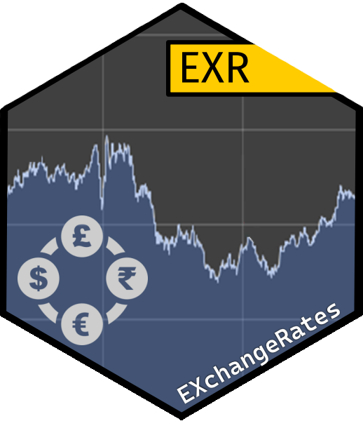
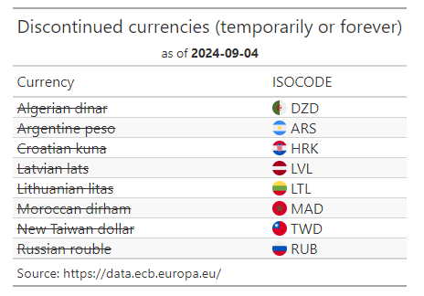

<!-- README.md is generated from README.Rmd. Please edit that file -->

# EXR // EXchangeRates 

<!-- badges: start -->

[](https://www.repostatus.org/#wip)
[](https://github.com/obsaditelnost/EXR/actions/workflows/R-CMD-check.yaml)
[](https://app.codecov.io/gh/obsaditelnost/EXR)
[](https://cran.r-project.org/web/licenses/MIT)

<!-- badges: end -->

## Overview

Get currency exchange rates (‘EXR’) or directly apply currency
conversion on a tibble from one to another currency based on spot prices
(average) provided by ‘ECB Data Portal’ (European Central Bank). If
neither the price currency nor base currency is EUR, unofficial
cross-rates based on EUR will be calculated. The main purpose of this
package is to offer an unlimited and free way to get (potentially
approximate) important exchange rates.

|                                   |                                                      |
|-----------------------------------|------------------------------------------------------|
| **Why use this package?**         | **When not to use this package**                     |
| ✅Free API with decades of data   | ❌If you need intraday data                          |
| ✅Unlimited API calls             | ❌If you need ask / bid / mid prices                 |
| ✅No key or registration required | ❌If you need rates from a specific domain (non-ECB) |
| ✅Helpful errors and warnings     | ❌If you need exchange rates for business purposes   |
| ✅Works well with tables          | ❌If you need exchange rates for all currencies      |

## What this package can do

- Get exchange rate for a currency pair
- Get exchange rate history for a currency pair or multiple pairs
- Get all cross-rates for a specific day (or a subset)
- Get last N days of exchange rate history
- You have a `data.table` (or tibble) with a currency value and you want
  to transform it to another currency
  - maybe the base currency is dynamic and a separate column in your
    table?
  - maybe the table contains different dates, specified in a column

## Limitations and considerations

- Only supports currencies that have a ECB Euro foreign exchange
  reference rate.
- Because only reference rates are available, the calculation of
  cross-rates might be very different from official exchange rates,
  especially for currencies with less trade volume
- API results are not deterministic. Data may be added or changed at any
  time
- API answer might take some seconds for huge requests or massive load
  on the web service

## Installation

You can install the development version of EXR from
[GitHub](https://github.com/) with:

``` r
# install.packages("pak")
pak::pak("obsaditelnost/EXR")
```

## Requirements

You need to have access to the [ECB Data Web Service
API](https://data-api.ecb.europa.eu/ "ECB Data Web Service API")

## Code examples

### Available currencies

Let’s first see which currencies are actually available:

``` r
EXR::get_available_currencies()
#> # A tibble: 31 × 2
#>   ISOCODE TITLE            
#>   <chr>   <chr>            
#> 1 AUD     Australian dollar
#> 2 BGN     Bulgarian lev    
#> 3 BRL     Brazilian real   
#> 4 CAD     Canadian dollar  
#> 5 CHF     Swiss franc      
#> # ℹ 26 more rows
```

This can be displayed a bit prettier:

``` r
EXR::get_available_currencies() |>
  dplyr::mutate(flag = substr(ISOCODE, 1, 2)) |>
  dplyr::arrange(TITLE) |>
  gt::gt() |>
  gt::fmt_flag(columns = flag) |>
  gt::cols_merge(columns = c(flag, ISOCODE)) |>
  gt::cols_label(flag = "ISOCODE", TITLE = "Currency") |>
  gt::tab_header(
    title = "Available currencies",
    subtitle = gt::md(paste0("as of **", Sys.Date(), "**"))
  ) |>
  gt::tab_source_note("Source: https://data.ecb.europa.eu/") |>
  gt::tab_options(data_row.padding = gt::px(0))  
```

<div align="center">


</div>

### Discontinued currencies

Some exchange rates have been published in the past, but are not
available any more:

``` r
dplyr::anti_join(
  EXR::get_available_currencies(as.Date("2014-01-02")),
  EXR::get_available_currencies(as.Date("2024-01-02")),
  by = dplyr::join_by(ISOCODE, TITLE)
) |>
  dplyr::mutate(flag = substr(ISOCODE, 1, 2), TITLE = gt::md(paste0("~", TITLE, "~"))) |>
  dplyr::arrange(TITLE) |>
  gt::gt() |>
  gt::fmt_flag(columns = flag) |>
  gt::fmt_markdown(columns = TITLE) |>
  gt::cols_merge(columns = c(flag, ISOCODE)) |>
  gt::cols_label(flag = "ISOCODE", TITLE = "Currency") |>
  gt::tab_header(
    title = "Discontinued currencies (temporarily or forever)",
    subtitle = gt::md(paste0("as of **", Sys.Date(), "**"))
  ) |>
  gt::tab_source_note("Source: https://data.ecb.europa.eu/")|>
  gt::tab_options(data_row.padding = gt::px(0)) |>
  gt::cols_align(align = "left", columns = TITLE)
```

<div align="center">



</div>

### Get history for one currency pair

This is a basic example which shows you how to solve a common problem,
like getting the history of USD/EUR exchange rates for the last year.
Fill missing dates and look for missing values up to 3 days in the past
so there won’t be exchange rates on very long weekends that include
holidays, like Christmas for example.

``` r
EXR::get_exchange_rate_history(
  base_currency = "EUR",
  price_currency = "USD",
  periodicity = "D",
  fill_missing_dates = TRUE,
  max_lookback_days = 3
)[1:10, ]
#> # A tibble: 10 × 7
#>    base_currency price_currency period     value periodicity context raw  
#>    <chr>         <chr>          <date>     <dbl> <chr>       <chr>   <lgl>
#>  1 EUR           USD            2023-09-03  1.08 D           A       FALSE
#>  2 EUR           USD            2023-09-04  1.08 D           A       TRUE 
#>  3 EUR           USD            2023-09-05  1.07 D           A       TRUE 
#>  4 EUR           USD            2023-09-06  1.07 D           A       TRUE 
#>  5 EUR           USD            2023-09-07  1.07 D           A       TRUE 
#>  6 EUR           USD            2023-09-08  1.07 D           A       TRUE 
#>  7 EUR           USD            2023-09-09  1.07 D           A       FALSE
#>  8 EUR           USD            2023-09-10  1.07 D           A       FALSE
#>  9 EUR           USD            2023-09-11  1.07 D           A       TRUE 
#> 10 EUR           USD            2023-09-12  1.07 D           A       TRUE
```

#### Use history to create plots

If we have a time series, we can do with it whatever we want:

``` r
EXR::get_exchange_rate_history(base_currency = "EUR", price_currency = "USD") |>
  dplyr::mutate(
    end = value,
    start = dplyr::lag(value, order_by = period),
    period_end = EXR::sdmx_character_to_date(period),
    sign = ifelse(end - start < 0, "negative", "positive")
  ) |>
  dplyr::filter(!is.na(start)) |>
  ggplot2::ggplot(ggplot2::aes(x = period_end, fill = sign)) +
  ggplot2::geom_rect(ggplot2::aes(xmin = period_end - 1, xmax = period_end, 
                                  ymin = end, ymax = start)) +
  ggplot2::scale_fill_manual(values = c("red", "green")) +
  ggplot2::theme_minimal() +
  ggplot2::labs(x = "day", y = "exchange rate", title = "Daily USD/EUR exchange rate", 
                subtitle = paste0("For 1 year as of ", Sys.Date() - 1))
```


#### Request last n elements from a history

Maybe we want to fetch the *last* 10 years of annual data for different
currencies *as of a specific period/date*. Let’s assume we want data
from 2020 up to 10 years into the past:

``` r
EXR::get_exchange_rate_history(
  base_currency = c("USD"),
  price_currency = c("EUR", "THB", "GBP"), periodicity = "A", context = "E", show_metadata = FALSE,
  filter = list(endPeriod = as.Date("2020-12-31"), lastNObservations = 10)
) |>
  tidyr::pivot_wider(names_from = price_currency, values_from = value, 
                     names_glue = "{price_currency}/USD") |>
  dplyr::mutate(base_currency = NULL)
#> # A tibble: 10 × 4
#>    period `EUR/USD` `THB/USD` `GBP/USD`
#>     <dbl>     <dbl>     <dbl>     <dbl>
#>  1   2011     0.773      31.7     0.646
#>  2   2012     0.758      30.6     0.619
#>  3   2013     0.725      32.8     0.605
#>  4   2014     0.824      32.9     0.642
#>  5   2015     0.919      36.1     0.674
#>  6   2016     0.949      35.8     0.812
#>  7   2017     0.834      32.6     0.740
#>  8   2018     0.873      32.4     0.781
#>  9   2019     0.890      29.7     0.757
#> 10   2020     0.815      29.9     0.733
```

## Further information

When talking about an “exchange rate” we (users of this package)
*always* define the rate as “*we get x units of the price currency if we
pay 1 unit of the base currency*”

$$ \frac{price}{base} = x $$

So for a currency pair USD/EUR we’d expect an exchange rate of about 1.1
because we define “EUR” as the base because it’s the denominator.

In finance there are different approaches (direct / indirect quotations)
so we need to define this in advance.

### ECB foreign exchange reference rates

As
[stated](https://www.ecb.europa.eu/stats/policy_and_exchange_rates/euro_reference_exchange_rates/html/index.en.html)
by the European Central Bank

> the reference rates are usually updated at around 16:00 CET every
> working day, except on TARGET closing days.
>
> They are based on the daily concertation procedure between central
> banks across Europe, which normally takes place around 14:10 CET. The
> reference rates are published for information purposes only. Using the
> rates for transaction purposes is strongly discouraged.

Some bank are not very transparent about their fees in FX transactions.
That’s why the ECB wants consumers to be easily able to compare the
different exchange rates (bank, airport, financial transactions).

### bid, ask, mid, intraday rates

Let’s assume that the current exchange rate for THB/USD is about 35
(average / mid price). If you want to convert 1000 USD into THB, you
would get around 35,000 THB.

- Some people what to sell THB but they have a minimum price expectation
  (sellers “ask” for an offer - and the lowest ask price across all
  sellers is the ask-rate for this currency)

- Some people what to buy THB but they have a maximum price expectation
  (buyers “bid” - the highest rate across all buyers the the bid-rate)

The mid-price is just the middle of them. You are in a currency exchange
booth and want to “buy” THB with your USD, the booth asks for many USD
(they want some fees of course)… so the ask-price might be 34 THB/USD.
The bid-price for THB might be around 36 THB/USD.

In many cases you only see one price though. For example you pay with a
credit card and 1 week later you see some currency conversion - without
any market knowledge you can’t know if 34.22 was a “fair” or “unfair”
exchange rate for you. For this purpose the foreign exchange reference
rates may be an acceptable indicator.

Some exchange rates are static and don’t change (very often) like the
GBP and British Overseas Territories such as Gibraltar. For other
currencies, during a day the exchange rates may have high fluctuations
though - up so several percent. Therefore a single value for a day can
always only be a rough indicator and never an exact value.

### cross-rates

Let’s assume you want to know the exchange rate for GBP/THB. Maybe
nobody at the market might want to do such a transaction or there is
just no official exchange rate for that pair.

If we know the exchange rate for GBP/EUR and THB/EUR, we can derive the
GBP/THB exchange rate by calculation a “cross-rate”:

$$ \frac{GBP}{EUR} = 0.84   $$

$$ \frac{THB}{EUR}=38 $$

So if we get 0.84 GBP for 1€ and 38 THB for 1€, we should get more than
40 THB for a GBP because as of “now” one GBP has more value that one
Euro. To calculate this we can simply apply:

$$
\frac{GBP}{THB} = \frac{(\frac{THB}{basecurrency})}{(\frac{GPB}{basecurrency})}= \frac{(\frac{THB}{EUR})}{(\frac{GPB}{EUR})} = \frac{38}{0.84} ≈ 45.238
$$

The API only offers EUR as base currency, so all cross-rates for
non-available currency pairs are calculated by using EUR-rates. If we
look back at [bid, ask, mid, intraday
rates](#bid-ask-mid-intraday-rates) we may see that this approach is
quite simple and prone to inaccuracy because we don’t take bid and ask
prices into account for such a calculation.
